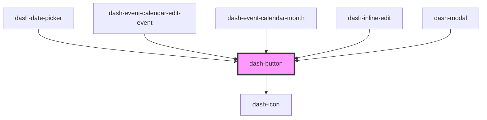

# dash-button

<!-- Auto Generated Below -->

## Properties

| Property     | Attribute    | Description                                    | Type                   | Default     |
| ------------ | ------------ | ---------------------------------------------- | ---------------------- | ----------- |
| `appearance` | `appearance` | Visible appearance of the button               | `"clear" \| "outline"` | `'clear'`   |
| `disabled`   | `disabled`   | When `true`, disables interaction              | `boolean`              | `false`     |
| `scale`      | `scale`      | Size of button                                 | `"l" \| "m" \| "s"`    | `'m'`       |
| `startIcon`  | `start-icon` | Icon displayed at the start of the button      | `string`               | `undefined` |
| `status`     | `status`     | Status of the button shown with various styles | `"error" \| "success"` | `undefined` |

## Methods

### `setFocus() => Promise<void>`

Sets focus on this element

#### Returns

Type: `Promise<void>`

## Dependencies

### Used by

 - [dash-date-picker](../dash-date-picker)
 - [dash-event-calendar-edit-event](../dash-event-calendar/dash-event-calendar-edit-event)
 - [dash-event-calendar-month](../dash-event-calendar/dash-event-calendar-month)
 - [dash-inline-edit](../dash-inline-edit)
 - [dash-modal](../dash-modal)

### Depends on

- [dash-icon](../dash-icon)

### Graph

----------------------------------------------

*Built with [StencilJS](https://stenciljs.com/)*
