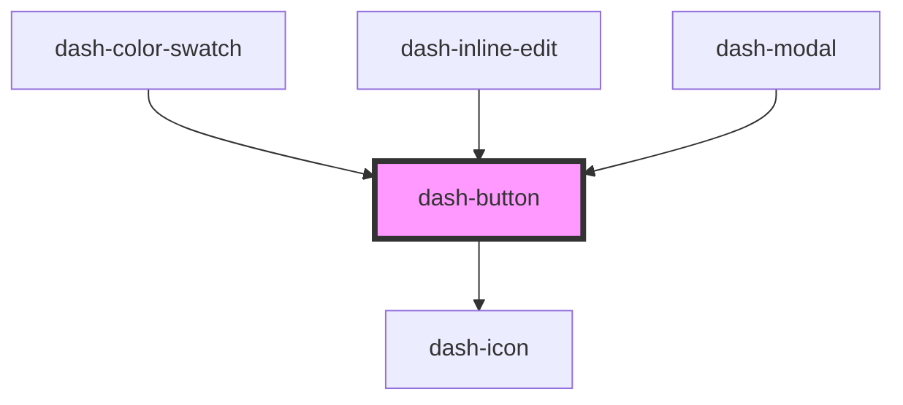

# dash-button

<!-- Auto Generated Below -->

## Properties

| Property    | Attribute    | Description | Type                        | Default     |
| ----------- | ------------ | ----------- | --------------------------- | ----------- |
| `disabled`  | `disabled`   |             | `boolean`                   | `undefined` |
| `scale`     | `scale`      |             | `"l" \| "m" \| "s" \| "xl"` | `undefined` |
| `startIcon` | `start-icon` |             | `string`                    | `undefined` |
| `status`    | `status`     |             | `"error" \| "success"`      | `undefined` |

## Methods

### `setFocus() => Promise<void>`

#### Returns

Type: `Promise<void>`

## Dependencies

### Used by

 - [dash-color-swatch](../dash-color-swatch)
 - [dash-inline-edit](../dash-inline-edit)
 - [dash-modal](../dash-modal)

### Depends on

- [dash-icon](../dash-icon)

### Graph

----------------------------------------------

*Built with [StencilJS](https://stenciljs.com/)*
