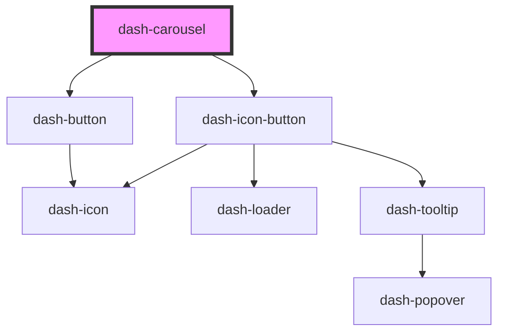

# dash-carousel

<!-- Auto Generated Below -->

## Properties

| Property | Attribute | Description                    | Type     | Default |
| -------- | --------- | ------------------------------ | -------- | ------- |
| `index`  | `index`   | The index of the current item. | `number` | `0`     |

## Dependencies

### Depends on

- [dash-icon-button](../dash-icon-button)
- [dash-button](../dash-button)

### Graph

----------------------------------------------

*Built with [StencilJS](https://stenciljs.com/)*
