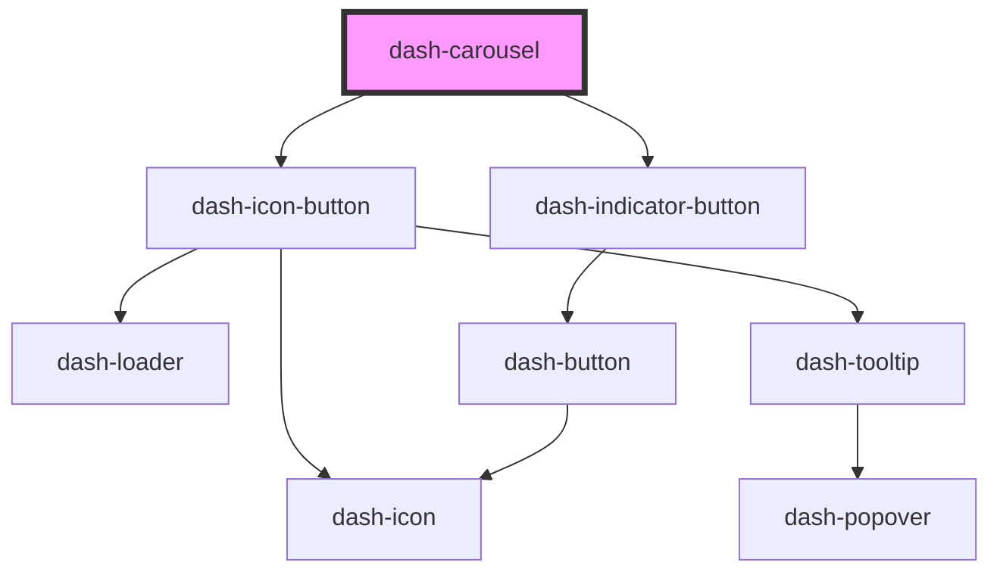

# dash-carousel

<!-- Auto Generated Below -->

## Properties

| Property      | Attribute | Description                | Type                          | Default     |
| ------------- | --------- | -------------------------- | ----------------------------- | ----------- |
| `currentItem` | --        | The carousel current item. | `HTMLDashCarouselItemElement` | `undefined` |

## Events

| Event                    | Description | Type                |
| ------------------------ | ----------- | ------------------- |
| `dashCarouselItemChange` |             | `CustomEvent<void>` |

## Dependencies

### Depends on

- [dash-icon-button](../dash-icon-button)
- [dash-indicator-button](../dash-indicator-button)

### Graph

----------------------------------------------

*Built with [StencilJS](https://stenciljs.com/)*
