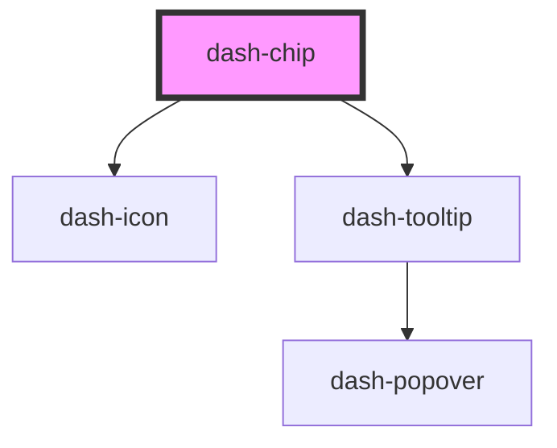

# dash-chip

<!-- Auto Generated Below -->

## Properties

| Property             | Attribute              | Description                                                     | Type      | Default     |
| -------------------- | ---------------------- | --------------------------------------------------------------- | --------- | ----------- |
| `color`              | `color`                | Background color of the chip                                    | `string`  | `undefined` |
| `dismissTooltipText` | `dismiss-tooltip-text` | Text to display when user focuses or hovers over dismiss button | `string`  | `undefined` |
| `dismissible`        | `dismissible`          | When true, chip can be removed                                  | `boolean` | `false`     |
| `heading`            | `heading`              | Displayed heading on the chip                                   | `string`  | `undefined` |
| `selectable`         | `selectable`           | When true, the chip can be interacted with                      | `boolean` | `undefined` |

## Events

| Event             | Description                      | Type               |
| ----------------- | -------------------------------- | ------------------ |
| `dashChipDismiss` | Emitted when the chip is removed | `CustomEvent<any>` |

## Dependencies

### Depends on

- [dash-icon](../dash-icon)
- [dash-tooltip](../dash-tooltip)

### Graph

----------------------------------------------

*Built with [StencilJS](https://stenciljs.com/)*
