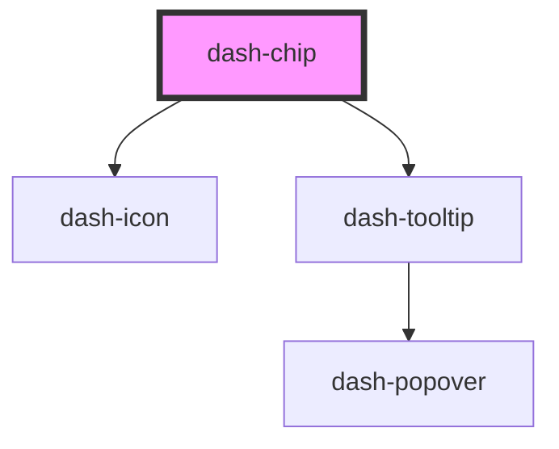

# dash-chip

<!-- Auto Generated Below -->

## Properties

| Property             | Attribute              | Description | Type      | Default     |
| -------------------- | ---------------------- | ----------- | --------- | ----------- |
| `color`              | `color`                |             | `string`  | `undefined` |
| `dismissTooltipText` | `dismiss-tooltip-text` |             | `string`  | `undefined` |
| `heading`            | `heading`              |             | `string`  | `undefined` |
| `removeable`         | `removeable`           |             | `boolean` | `undefined` |
| `selectable`         | `selectable`           |             | `boolean` | `undefined` |

## Events

| Event            | Description | Type               |
| ---------------- | ----------- | ------------------ |
| `dashChipRemove` |             | `CustomEvent<any>` |

## Dependencies

### Depends on

- [dash-icon](../dash-icon)
- [dash-tooltip](../dash-tooltip)

### Graph

----------------------------------------------

*Built with [StencilJS](https://stenciljs.com/)*
