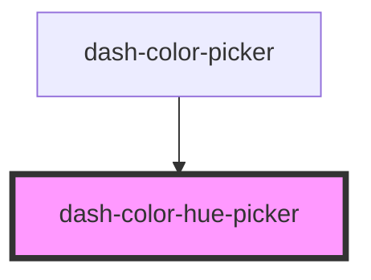

# dash-color-hue-picker

<!-- Auto Generated Below -->

## Properties

| Property | Attribute | Description                     | Type     | Default |
| -------- | --------- | ------------------------------- | -------- | ------- |
| `hue`    | `hue`     | Hue value from [0, 360]         | `number` | `0`     |
| `width`  | `width`   | Width of hue picker (in pixels) | `number` | `200`   |

## Events

| Event                          | Description                       | Type                |
| ------------------------------ | --------------------------------- | ------------------- |
| `dashColorHuePickerHueChanged` | Emitted when hue has been changed | `CustomEvent<void>` |

## Dependencies

### Used by

 - [dash-color-picker](../dash-color-picker)

### Graph

----------------------------------------------

*Built with [StencilJS](https://stenciljs.com/)*
