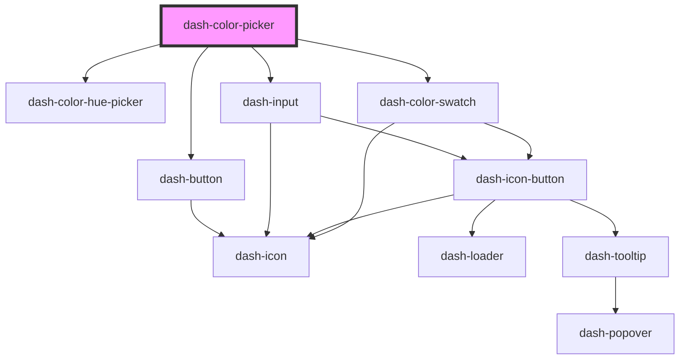

# dash-color-picker

<!-- Auto Generated Below -->

## Properties

| Property        | Attribute | Description      | Type                       | Default           |
| --------------- | --------- | ---------------- | -------------------------- | ----------------- |
| `defaultColors` | --        |                  | `string[]`                 | `[]`              |
| `hex`           | `hex`     | Hex color value  | `string`                   | `'#FFFFFF'`       |
| `hsv`           | --        | HSV color values | `[number, number, number]` | `[0, 0, 100]`     |
| `rgb`           | --        | RGB color values | `[number, number, number]` | `[255, 255, 255]` |

## Events

| Event                         | Description                          | Type                |
| ----------------------------- | ------------------------------------ | ------------------- |
| `dashColorPickerColorChanged` | Emitted when color has been selected | `CustomEvent<void>` |

## Dependencies

### Depends on

- [dash-color-hue-picker](../dash-color-hue-picker)
- [dash-button](../dash-button)
- [dash-input](../dash-input)
- [dash-color-swatch](../dash-color-swatch)

### Graph

----------------------------------------------

*Built with [StencilJS](https://stenciljs.com/)*
