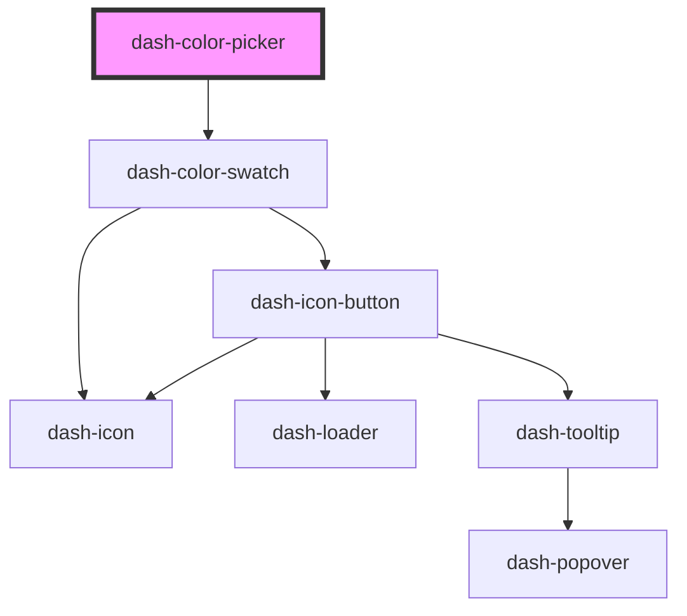

# dash-color-picker

<!-- Auto Generated Below -->

## Properties

| Property | Attribute | Description | Type                                                                                                                  | Default     |
| -------- | --------- | ----------- | --------------------------------------------------------------------------------------------------------------------- | ----------- |
| `color`  | `color`   |             | `"baby-blue" \| "dark-blue" \| "green-apple" \| "green-grass" \| "orange" \| "pink" \| "purple" \| "red" \| "yellow"` | `undefined` |
| `colors` | --        |             | `Color[]`                                                                                                             | `[]`        |
| `cols`   | `cols`    |             | `number`                                                                                                              | `undefined` |

## Events

| Event                         | Description | Type                |
| ----------------------------- | ----------- | ------------------- |
| `dashColorPickerColorChanged` |             | `CustomEvent<void>` |

## Dependencies

### Depends on

- [dash-color-swatch](../dash-color-swatch)

### Graph

----------------------------------------------

*Built with [StencilJS](https://stenciljs.com/)*
