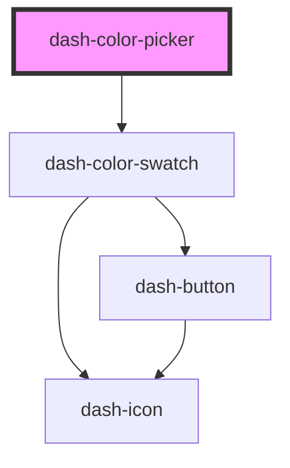

# dash-color-picker

<!-- Auto Generated Below -->

## Properties

| Property | Attribute | Description | Type      | Default     |
| -------- | --------- | ----------- | --------- | ----------- |
| `colors` | --        |             | `Color[]` | `[]`        |
| `cols`   | `cols`    |             | `number`  | `undefined` |

## Events

| Event                         | Description | Type                                                                                                                               |
| ----------------------------- | ----------- | ---------------------------------------------------------------------------------------------------------------------------------- |
| `dashColorPickerColorChanged` |             | `CustomEvent<"baby-blue" \| "dark-blue" \| "green-apple" \| "green-grass" \| "orange" \| "pink" \| "purple" \| "red" \| "yellow">` |

## Dependencies

### Depends on

- [dash-color-swatch](../dash-color-swatch)

### Graph

----------------------------------------------

*Built with [StencilJS](https://stenciljs.com/)*
