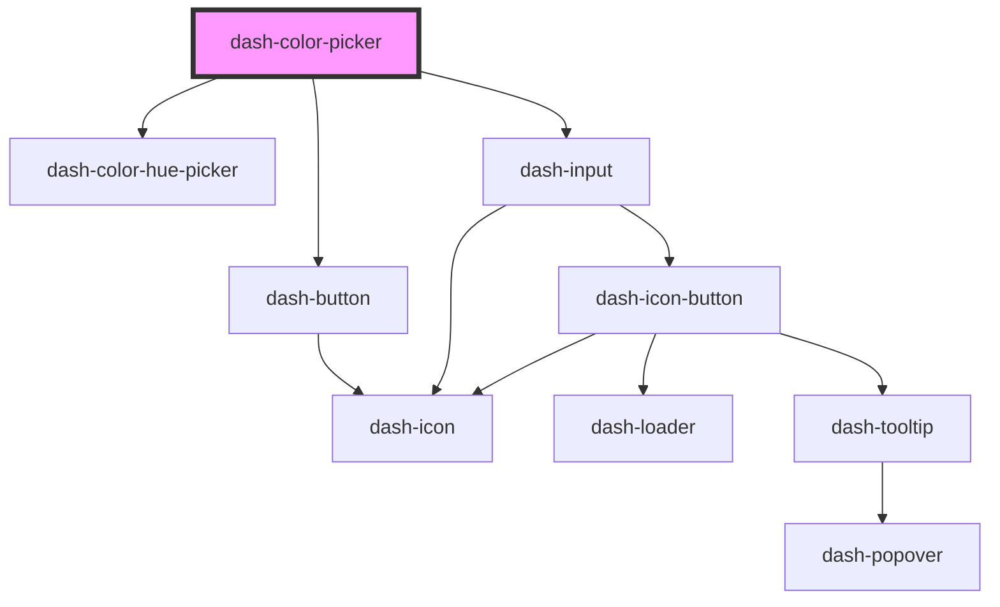

# dash-color-picker

<!-- Auto Generated Below -->

## Properties

| Property        | Attribute        | Description                                                                                     | Type                                                                                                                  | Default           |
| --------------- | ---------------- | ----------------------------------------------------------------------------------------------- | --------------------------------------------------------------------------------------------------------------------- | ----------------- |
| `color`         | `color`          | Currently selected color                                                                        | `"baby-blue" \| "dark-blue" \| "green-apple" \| "green-grass" \| "orange" \| "pink" \| "purple" \| "red" \| "yellow"` | `undefined`       |
| `colors`        | --               | Colors to pick from                                                                             | `Color[]`                                                                                                             | `[]`              |
| `cols`          | `cols`           | Number of columns to display for colors - ex. 3 cols means colors will be split among 3 columns | `number`                                                                                                              | `undefined`       |
| `hex`           | `hex`            | Hex color value                                                                                 | `string`                                                                                                              | `'#FFFFFF'`       |
| `hsv`           | --               | HSV color values                                                                                | `[number, number, number]`                                                                                            | `[0, 0, 100]`     |
| `rgb`           | --               | RGB color values                                                                                | `[number, number, number]`                                                                                            | `[255, 255, 255]` |
| `selectedColor` | `selected-color` | Currently selected color                                                                        | `string`                                                                                                              | `undefined`       |

## Events

| Event                         | Description                          | Type                |
| ----------------------------- | ------------------------------------ | ------------------- |
| `dashColorPickerColorChanged` | Emitted when color has been selected | `CustomEvent<void>` |

## Dependencies

### Depends on

- [dash-color-hue-picker](../dash-color-hue-picker)
- [dash-button](../dash-button)
- [dash-input](../dash-input)

### Graph

----------------------------------------------

*Built with [StencilJS](https://stenciljs.com/)*
