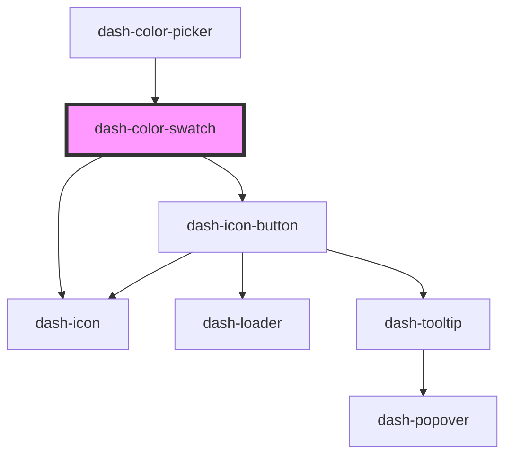

# dash-color-swatch

<!-- Auto Generated Below -->

## Properties

| Property   | Attribute  | Description | Type                        | Default     |
| ---------- | ---------- | ----------- | --------------------------- | ----------- |
| `color`    | `color`    |             | `string`                    | `undefined` |
| `scale`    | `scale`    |             | `"l" \| "m" \| "s" \| "xl"` | `undefined` |
| `selected` | `selected` |             | `boolean`                   | `undefined` |

## Methods

### `setFocus() => Promise<void>`

#### Returns

Type: `Promise<void>`

## Dependencies

### Used by

 - [dash-color-picker](../dash-color-picker)

### Depends on

- [dash-icon-button](../dash-icon-button)
- [dash-icon](../dash-icon)

### Graph

----------------------------------------------

*Built with [StencilJS](https://stenciljs.com/)*
