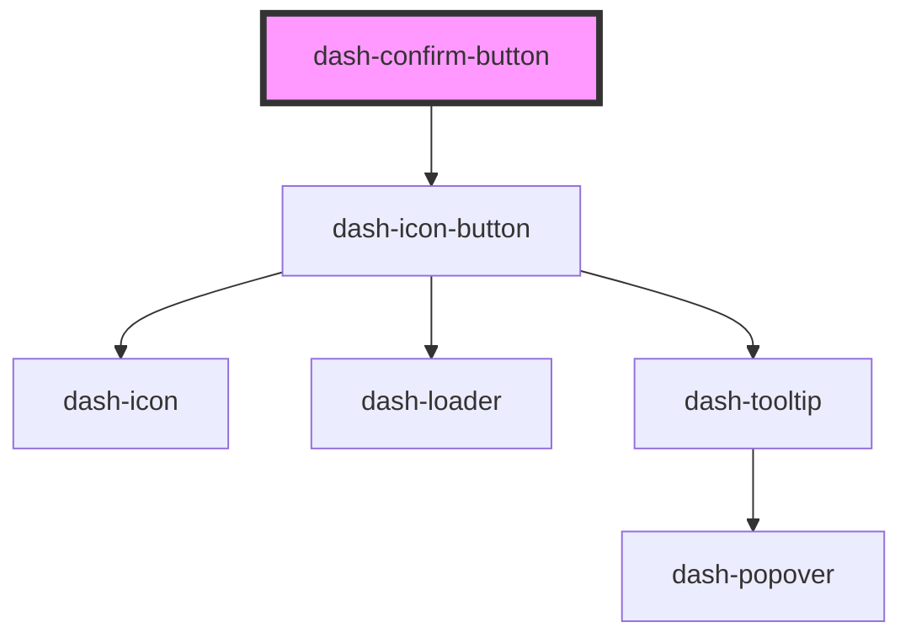

# dash-confirm-button

<!-- Auto Generated Below -->

## Properties

| Property | Attribute | Description                                     | Type                | Default     |
| -------- | --------- | ----------------------------------------------- | ------------------- | ----------- |
| `icon`   | `icon`    | Icon used in button that triggers confirm state | `string`            | `undefined` |
| `scale`  | `scale`   | Size of the confirm button                      | `"l" \| "m" \| "s"` | `undefined` |

## Events

| Event                        | Description                | Type               |
| ---------------------------- | -------------------------- | ------------------ |
| `dashConfirmButtonConfirmed` | Emitted when user confirms | `CustomEvent<any>` |

## Dependencies

### Depends on

- [dash-icon-button](../dash-icon-button)

### Graph

----------------------------------------------

*Built with [StencilJS](https://stenciljs.com/)*
