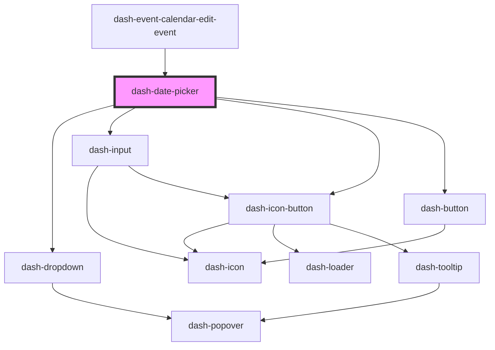

# dash-date-picker

<!-- Auto Generated Below -->

## Properties

| Property        | Attribute         | Description                                            | Type                    | Default                                              |
| --------------- | ----------------- | ------------------------------------------------------ | ----------------------- | ---------------------------------------------------- |
| `closeOnSelect` | `close-on-select` | Close the date picker dropdown when a date is selected | `boolean`               | `true`                                               |
| `date`          | `date`            |                                                        | `string`                | `new Date().toISOString()`                           |
| `format`        | --                | format of date picker label                            | `DateTimeFormatOptions` | `{ month: 'long', weekday: 'long', day: 'numeric' }` |

## Events

| Event                      | Description | Type                |
| -------------------------- | ----------- | ------------------- |
| `dashDatePickerDateChange` |             | `CustomEvent<void>` |

## Dependencies

### Used by

 - [dash-event-calendar-edit-event](../dash-event-calendar/dash-event-calendar-edit-event)

### Depends on

- [dash-dropdown](../dash-dropdown)
- [dash-input](../dash-input)
- [dash-icon-button](../dash-icon-button)
- [dash-button](../dash-button)

### Graph

----------------------------------------------

*Built with [StencilJS](https://stenciljs.com/)*
