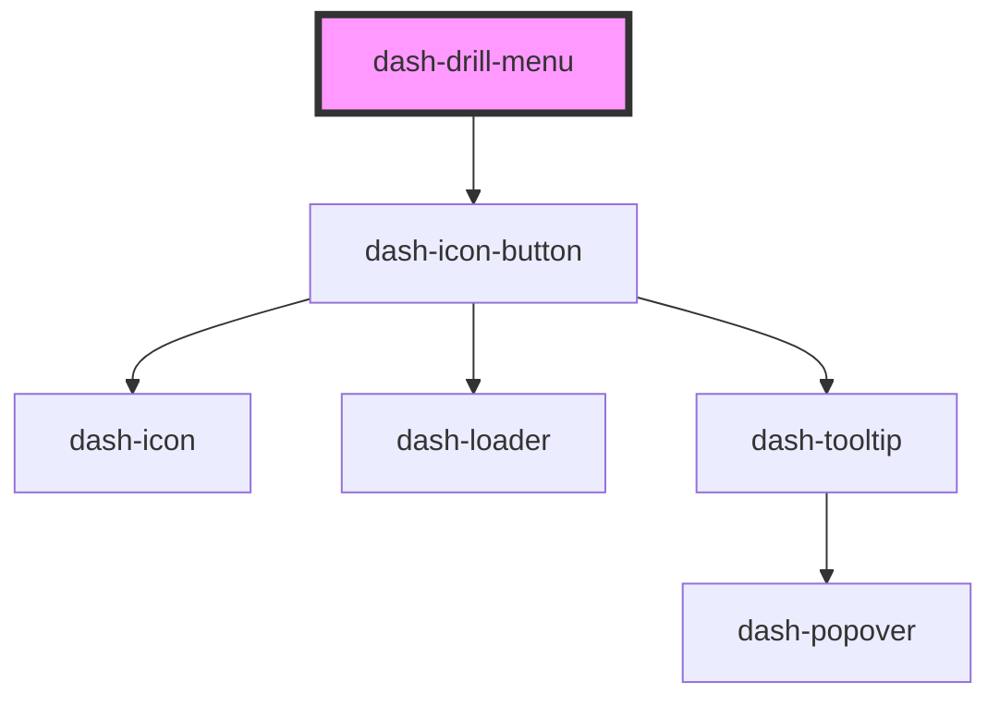

# dash-drill-menu

<!-- Auto Generated Below -->

## Properties

| Property       | Attribute       | Description | Type      | Default     |
| -------------- | --------------- | ----------- | --------- | ----------- |
| `active`       | `active`        |             | `boolean` | `undefined` |
| `drillHeading` | `drill-heading` |             | `string`  | `undefined` |

## Events

| Event                 | Description | Type               |
| --------------------- | ----------- | ------------------ |
| `dashDrillMenuClosed` |             | `CustomEvent<any>` |

## Dependencies

### Depends on

- [dash-icon-button](../dash-icon-button)

### Graph

----------------------------------------------

*Built with [StencilJS](https://stenciljs.com/)*
