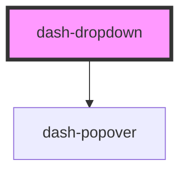

# dash-dropdown

<!-- Auto Generated Below -->

## Properties

| Property            | Attribute            | Description | Type                                                                                                                                                                                                         | Default      |
| ------------------- | -------------------- | ----------- | ------------------------------------------------------------------------------------------------------------------------------------------------------------------------------------------------------------ | ------------ |
| `autoClose`         | `auto-close`         |             | `boolean`                                                                                                                                                                                                    | `undefined`  |
| `open`              | `open`               |             | `boolean`                                                                                                                                                                                                    | `false`      |
| `placement`         | `placement`          |             | `"auto" \| "auto-end" \| "auto-start" \| "bottom" \| "bottom-end" \| "bottom-start" \| "left" \| "left-end" \| "left-start" \| "right" \| "right-end" \| "right-start" \| "top" \| "top-end" \| "top-start"` | `'bottom'`   |
| `placementStrategy` | `placement-strategy` |             | `"absolute" \| "fixed"`                                                                                                                                                                                      | `'absolute'` |

## Events

| Event                    | Description | Type                |
| ------------------------ | ----------- | ------------------- |
| `dashDropdownOpenChange` |             | `CustomEvent<void>` |

## Methods

### `close(focusTarget?: boolean) => Promise<void>`

#### Returns

Type: `Promise<void>`

## Dependencies

### Depends on

- [dash-popover](../dash-popover)

### Graph

----------------------------------------------

*Built with [StencilJS](https://stenciljs.com/)*
