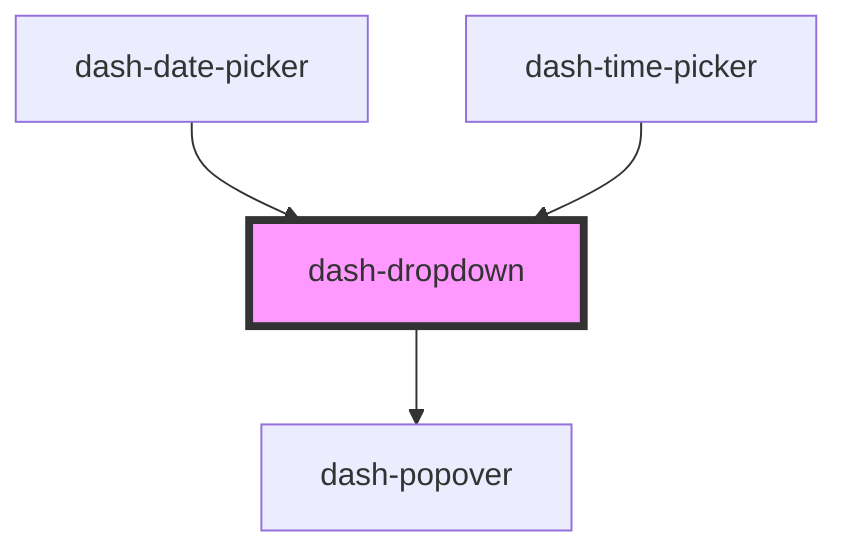

# dash-dropdown

<!-- Auto Generated Below -->

## Properties

| Property            | Attribute            | Description                                         | Type                                                                                                                                                                                                         | Default      |
| ------------------- | -------------------- | --------------------------------------------------- | ------------------------------------------------------------------------------------------------------------------------------------------------------------------------------------------------------------ | ------------ |
| `autoClose`         | `auto-close`         | When `true`, dropdown will close when focus is lost | `boolean`                                                                                                                                                                                                    | `undefined`  |
| `autoFocus`         | `auto-focus`         | Auto focus dropdown content on open                 | `boolean`                                                                                                                                                                                                    | `true`       |
| `open`              | `open`               | When `true`, dropdown is open                       | `boolean`                                                                                                                                                                                                    | `false`      |
| `placement`         | `placement`          | Placement of the dropdown relative to its target    | `"auto" \| "auto-end" \| "auto-start" \| "bottom" \| "bottom-end" \| "bottom-start" \| "left" \| "left-end" \| "left-start" \| "right" \| "right-end" \| "right-start" \| "top" \| "top-end" \| "top-start"` | `'bottom'`   |
| `placementStrategy` | `placement-strategy` | Placement strategy for dropdown                     | `"absolute" \| "fixed"`                                                                                                                                                                                      | `'absolute'` |

## Events

| Event                    | Description                                      | Type                |
| ------------------------ | ------------------------------------------------ | ------------------- |
| `dashDropdownOpenChange` | Emitted when dropdown is either opened or closed | `CustomEvent<void>` |

## Methods

### `close(focusTarget?: boolean) => Promise<void>`

Close the dropdown

#### Returns

Type: `Promise<void>`

## Dependencies

### Used by

 - [dash-date-picker](../dash-date-picker)
 - [dash-time-picker](../dash-time-picker)

### Depends on

- [dash-popover](../dash-popover)

### Graph

----------------------------------------------

*Built with [StencilJS](https://stenciljs.com/)*
