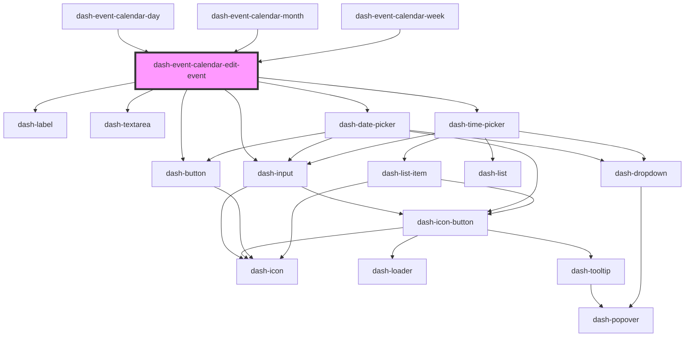

# dash-event-calendar-edit-event

<!-- Auto Generated Below -->

## Properties

| Property | Attribute | Description | Type                                     | Default     |
| -------- | --------- | ----------- | ---------------------------------------- | ----------- |
| `event`  | --        |             | `CalendarEvent \| CalendarEventInternal` | `undefined` |

## Events

| Event                                   | Description | Type                |
| --------------------------------------- | ----------- | ------------------- |
| `dashEventCalendarEditEventEventCancel` |             | `CustomEvent<void>` |
| `dashEventCalendarEditEventEventUpdate` |             | `CustomEvent<void>` |

## Dependencies

### Used by

 - [dash-event-calendar-day](../dash-event-calendar-day)
 - [dash-event-calendar-month](../dash-event-calendar-month)
 - [dash-event-calendar-week](../dash-event-calendar-week)

### Depends on

- [dash-label](../../dash-label)
- [dash-input](../../dash-input)
- [dash-textarea](../../dash-textarea)
- [dash-date-picker](../../dash-date-picker)
- [dash-time-picker](../../dash-time-picker)
- [dash-button](../../dash-button)

### Graph

----------------------------------------------

*Built with [StencilJS](https://stenciljs.com/)*
