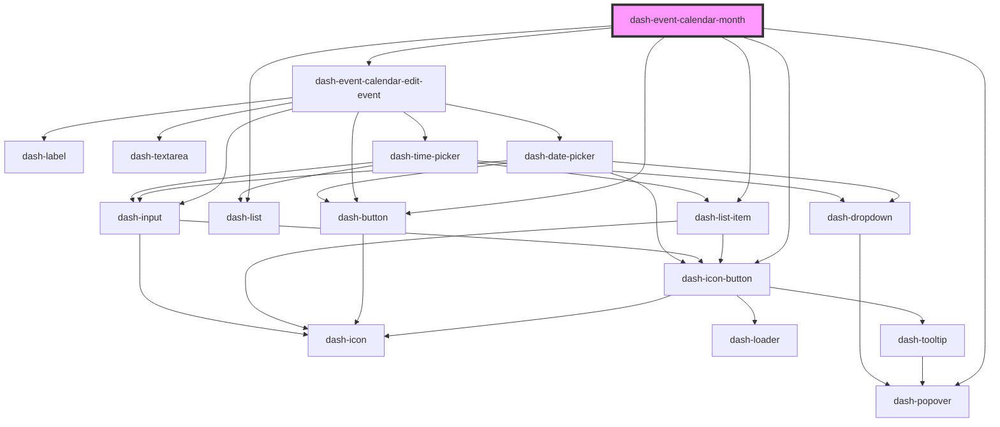

# dash-event-calendar-month

<!-- Auto Generated Below -->

## Properties

| Property | Attribute | Description | Type              | Default     |
| -------- | --------- | ----------- | ----------------- | ----------- |
| `date`   | `date`    |             | `string`          | `undefined` |
| `events` | --        |             | `CalendarEvent[]` | `[]`        |

## Events

| Event                          | Description | Type                                |
| ------------------------------ | ----------- | ----------------------------------- |
| `dashEventCalendarDeleteEvent` |             | `CustomEvent<{ eventId: string; }>` |
| `dashEventCalendarEditEvent`   |             | `CustomEvent<{ eventId: string; }>` |
| `dashEventCalendarNextMonth`   |             | `CustomEvent<void>`                 |
| `dashEventCalendarPrevMonth`   |             | `CustomEvent<void>`                 |

## Dependencies

### Depends on

- [dash-icon-button](../../dash-icon-button)
- [dash-button](../../dash-button)
- [dash-list](../../dash-list)
- [dash-list-item](../../dash-list-item)
- [dash-popover](../../dash-popover)
- [dash-event-calendar-edit-event](../dash-event-calendar-edit-event)

### Graph

----------------------------------------------

*Built with [StencilJS](https://stenciljs.com/)*
