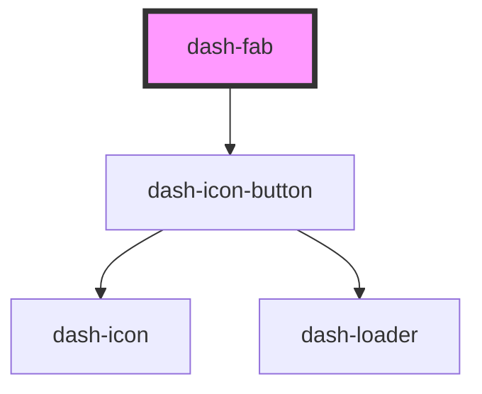

# dash-fab

<!-- Auto Generated Below -->

## Properties

| Property    | Attribute    | Description | Type                        | Default     |
| ----------- | ------------ | ----------- | --------------------------- | ----------- |
| `icon`      | `icon`       |             | `string`                    | `undefined` |
| `iconScale` | `icon-scale` |             | `"l" \| "m" \| "s" \| "xl"` | `undefined` |

## Dependencies

### Depends on

- [dash-icon-button](../dash-icon-button)

### Graph

----------------------------------------------

*Built with [StencilJS](https://stenciljs.com/)*
