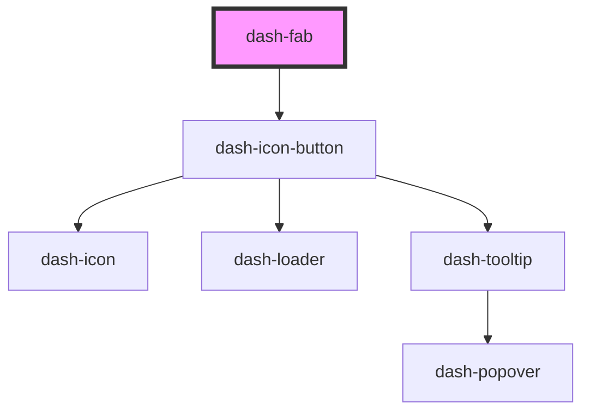

# dash-fab

<!-- Auto Generated Below -->

## Properties

| Property | Attribute | Description     | Type                        | Default     |
| -------- | --------- | --------------- | --------------------------- | ----------- |
| `icon`   | `icon`    | Icon to display | `string`                    | `undefined` |
| `scale`  | `scale`   | Size of the fab | `"l" \| "m" \| "s" \| "xl"` | `'m'`       |

## Dependencies

### Depends on

- [dash-icon-button](../dash-icon-button)

### Graph

----------------------------------------------

*Built with [StencilJS](https://stenciljs.com/)*
