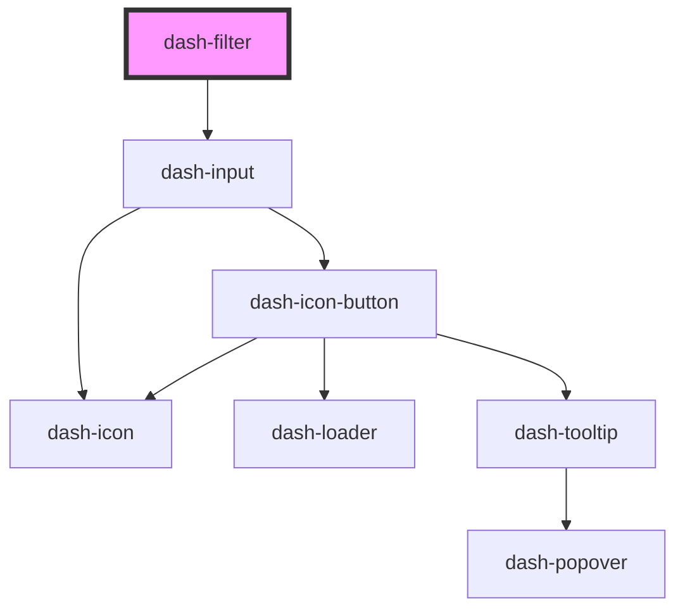

# dash-filter

<!-- Auto Generated Below -->

## Properties

| Property      | Attribute      | Description | Type                | Default     |
| ------------- | -------------- | ----------- | ------------------- | ----------- |
| `debounce`    | `debounce`     |             | `number`            | `250`       |
| `filterValue` | `filter-value` |             | `string`            | `undefined` |
| `items`       | --             |             | `string[] \| {}[]`  | `undefined` |
| `objKey`      | `obj-key`      |             | `string`            | `undefined` |
| `placeholder` | `placeholder`  |             | `string`            | `'Filter'`  |
| `scale`       | `scale`        |             | `"l" \| "m" \| "s"` | `'m'`       |

## Events

| Event                     | Description | Type                    |
| ------------------------- | ----------- | ----------------------- |
| `dashFilterFilteredItems` |             | `CustomEvent<object[]>` |
| `dashFilterSubmit`        |             | `CustomEvent<void>`     |
| `dashFilterValueChanged`  |             | `CustomEvent<void>`     |

## Methods

### `clear() => Promise<void>`

#### Returns

Type: `Promise<void>`

### `select() => Promise<void>`

#### Returns

Type: `Promise<void>`

### `setFocus() => Promise<void>`

#### Returns

Type: `Promise<void>`

## Dependencies

### Depends on

- [dash-input](../dash-input)

### Graph

----------------------------------------------

*Built with [StencilJS](https://stenciljs.com/)*
