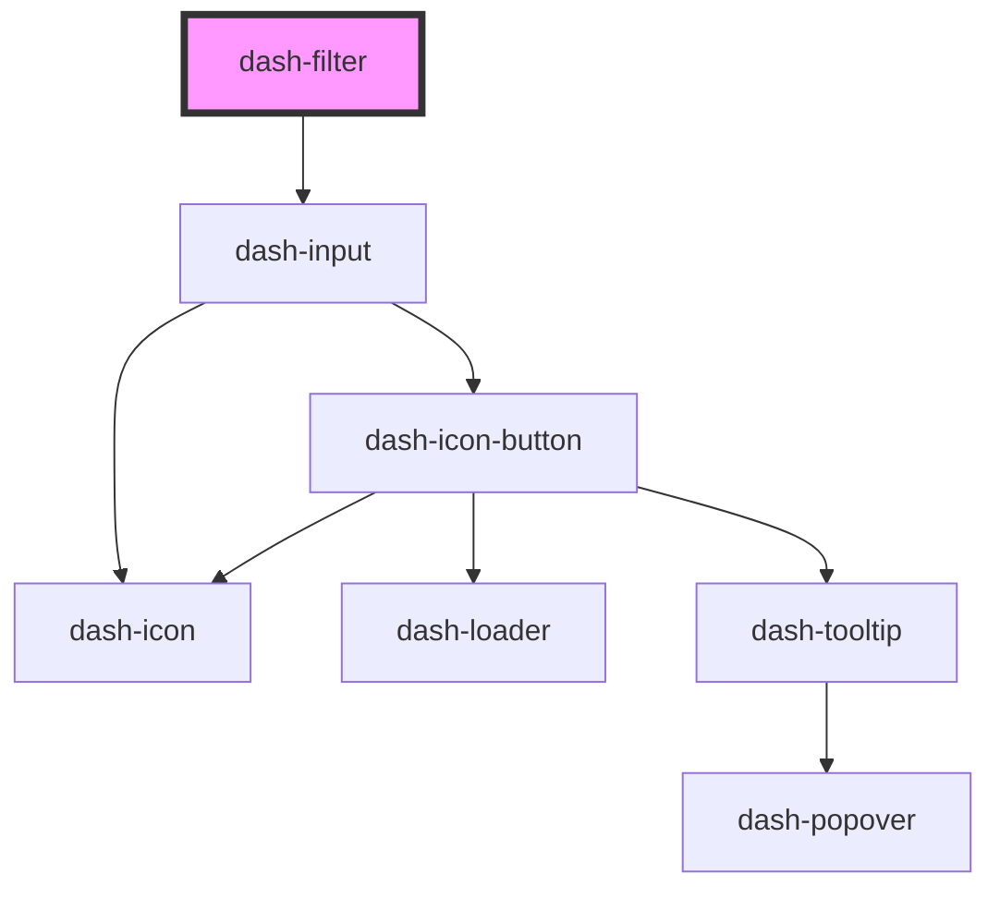

# dash-filter

<!-- Auto Generated Below -->

## Properties

| Property      | Attribute      | Description                                                                                        | Type                | Default     |
| ------------- | -------------- | -------------------------------------------------------------------------------------------------- | ------------------- | ----------- |
| `debounce`    | `debounce`     | Debounces input in milliseconds                                                                    | `number`            | `250`       |
| `filterValue` | `filter-value` | Value to filter items by                                                                           | `string`            | `undefined` |
| `items`       | --             | Items to filter                                                                                    | `string[] \| {}[]`  | `undefined` |
| `objKey`      | `obj-key`      | Key to filter items by. Supports up two two levels of nesting. For example, 'state.title' is valid | `string`            | `undefined` |
| `placeholder` | `placeholder`  | Placeholder text for input                                                                         | `string`            | `'Filter'`  |
| `scale`       | `scale`        | Size of the filter input                                                                           | `"l" \| "m" \| "s"` | `'m'`       |

## Events

| Event                     | Description                            | Type                    |
| ------------------------- | -------------------------------------- | ----------------------- |
| `dashFilterFilteredItems` | Emitted when filtered items change     | `CustomEvent<object[]>` |
| `dashFilterSubmit`        | Emitted when user submits filter input | `CustomEvent<void>`     |
| `dashFilterValueChanged`  | Emitted when filtered value changes    | `CustomEvent<void>`     |

## Methods

### `clear() => Promise<void>`

Clears filter value

#### Returns

Type: `Promise<void>`

### `select() => Promise<void>`

Selects text in filter input

#### Returns

Type: `Promise<void>`

### `setFocus() => Promise<void>`

Sets focus on this element

#### Returns

Type: `Promise<void>`

## Dependencies

### Depends on

- [dash-input](../dash-input)

### Graph

----------------------------------------------

*Built with [StencilJS](https://stenciljs.com/)*
