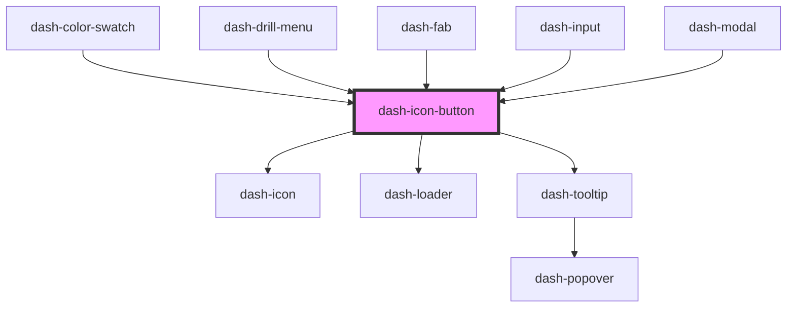

# dash-icon-button

<!-- Auto Generated Below -->

## Properties

| Property           | Attribute           | Description | Type                                                                                                                                                                                                         | Default     |
| ------------------ | ------------------- | ----------- | ------------------------------------------------------------------------------------------------------------------------------------------------------------------------------------------------------------ | ----------- |
| `disabled`         | `disabled`          |             | `boolean`                                                                                                                                                                                                    | `undefined` |
| `icon`             | `icon`              |             | `string`                                                                                                                                                                                                     | `undefined` |
| `iconScale`        | `icon-scale`        |             | `"l" \| "m" \| "s" \| "xl"`                                                                                                                                                                                  | `undefined` |
| `iconUrl`          | `icon-url`          |             | `string`                                                                                                                                                                                                     | `undefined` |
| `loading`          | `loading`           |             | `boolean`                                                                                                                                                                                                    | `undefined` |
| `rounded`          | `rounded`           |             | `boolean`                                                                                                                                                                                                    | `undefined` |
| `scale`            | `scale`             |             | `"l" \| "m" \| "s" \| "xl"`                                                                                                                                                                                  | `undefined` |
| `tooltipPlacement` | `tooltip-placement` |             | `"auto" \| "auto-end" \| "auto-start" \| "bottom" \| "bottom-end" \| "bottom-start" \| "left" \| "left-end" \| "left-start" \| "right" \| "right-end" \| "right-start" \| "top" \| "top-end" \| "top-start"` | `undefined` |
| `tooltipText`      | `tooltip-text`      |             | `string`                                                                                                                                                                                                     | `undefined` |
| `type`             | `type`              |             | `string`                                                                                                                                                                                                     | `undefined` |
| `width`            | `width`             |             | `number`                                                                                                                                                                                                     | `undefined` |

## Methods

### `setFocus() => Promise<void>`

#### Returns

Type: `Promise<void>`

## Dependencies

### Used by

 - [dash-color-swatch](../dash-color-swatch)
 - [dash-drill-menu](../dash-drill-menu)
 - [dash-fab](../dash-fab)
 - [dash-input](../dash-input)
 - [dash-modal](../dash-modal)

### Depends on

- [dash-icon](../dash-icon)
- [dash-loader](../dash-loader)
- [dash-tooltip](../dash-tooltip)

### Graph

----------------------------------------------

*Built with [StencilJS](https://stenciljs.com/)*
