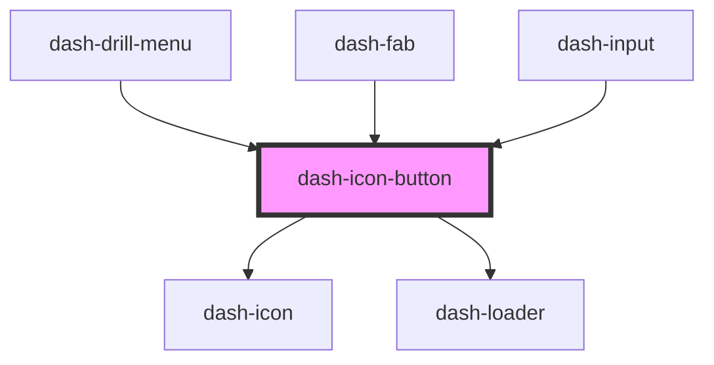

# dash-icon-button

<!-- Auto Generated Below -->

## Properties

| Property   | Attribute  | Description | Type                        | Default     |
| ---------- | ---------- | ----------- | --------------------------- | ----------- |
| `disabled` | `disabled` |             | `boolean`                   | `undefined` |
| `icon`     | `icon`     |             | `string`                    | `undefined` |
| `iconUrl`  | `icon-url` |             | `string`                    | `undefined` |
| `loading`  | `loading`  |             | `boolean`                   | `undefined` |
| `scale`    | `scale`    |             | `"l" \| "m" \| "s" \| "xl"` | `undefined` |
| `type`     | `type`     |             | `string`                    | `undefined` |
| `width`    | `width`    |             | `number`                    | `undefined` |

## Methods

### `setFocus() => Promise<void>`

#### Returns

Type: `Promise<void>`

## Dependencies

### Used by

 - [dash-drill-menu](../dash-drill-menu)
 - [dash-fab](../dash-fab)
 - [dash-input](../dash-input)

### Depends on

- [dash-icon](../dash-icon)
- [dash-loader](../dash-loader)

### Graph

----------------------------------------------

*Built with [StencilJS](https://stenciljs.com/)*
