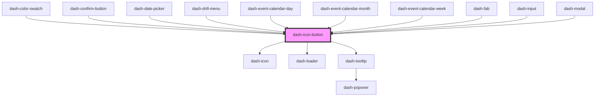

# dash-icon-button

<!-- Auto Generated Below -->

## Properties

| Property           | Attribute           | Description                                                                                 | Type                                                                                                                                                                                                         | Default     |
| ------------------ | ------------------- | ------------------------------------------------------------------------------------------- | ------------------------------------------------------------------------------------------------------------------------------------------------------------------------------------------------------------ | ----------- |
| `disabled`         | `disabled`          | When true, the icon button cannot be interacted with                                        | `boolean`                                                                                                                                                                                                    | `undefined` |
| `icon`             | `icon`              | Icon to display                                                                             | `string`                                                                                                                                                                                                     | `undefined` |
| `iconUrl`          | `icon-url`          | Icon to display from URL                                                                    | `string`                                                                                                                                                                                                     | `undefined` |
| `loading`          | `loading`           | When true, indicates the button is loading and cannot be interacted with                    | `boolean`                                                                                                                                                                                                    | `undefined` |
| `rounded`          | `rounded`           | When true, the icon button will be round                                                    | `boolean`                                                                                                                                                                                                    | `undefined` |
| `scale`            | `scale`             | Size of the icon button                                                                     | `"l" \| "m" \| "s" \| "xl"`                                                                                                                                                                                  | `'m'`       |
| `tooltipPlacement` | `tooltip-placement` | Indicates where the tooltip should be placed relative to the icon button                    | `"auto" \| "auto-end" \| "auto-start" \| "bottom" \| "bottom-end" \| "bottom-start" \| "left" \| "left-end" \| "left-start" \| "right" \| "right-end" \| "right-start" \| "top" \| "top-end" \| "top-start"` | `undefined` |
| `tooltipText`      | `tooltip-text`      | When provided, a tooltip will display when interacted with                                  | `string`                                                                                                                                                                                                     | `undefined` |
| `type`             | `type`              | HTML button type https://developer.mozilla.org/en-US/docs/Web/HTML/Element/button#attr-type | `string`                                                                                                                                                                                                     | `undefined` |

## Methods

### `setFocus() => Promise<void>`

Sets focus on this element

#### Returns

Type: `Promise<void>`

## Dependencies

### Used by

 - [dash-color-swatch](../dash-color-swatch)
 - [dash-confirm-button](../dash-confirm-button)
 - [dash-date-picker](../dash-date-picker)
 - [dash-drill-menu](../dash-drill-menu)
 - [dash-event-calendar-day](../dash-event-calendar/dash-event-calendar-day)
 - [dash-event-calendar-month](../dash-event-calendar/dash-event-calendar-month)
 - [dash-event-calendar-week](../dash-event-calendar/dash-event-calendar-week)
 - [dash-fab](../dash-fab)
 - [dash-input](../dash-input)
 - [dash-modal](../dash-modal)

### Depends on

- [dash-icon](../dash-icon)
- [dash-loader](../dash-loader)
- [dash-tooltip](../dash-tooltip)

### Graph

----------------------------------------------

*Built with [StencilJS](https://stenciljs.com/)*
