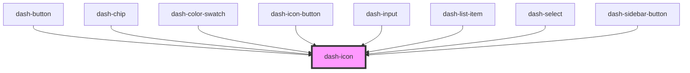

# dash-icon

<!-- Auto Generated Below -->

## Properties

| Property  | Attribute  | Description                  | Type                                    | Default     |
| --------- | ---------- | ---------------------------- | --------------------------------------- | ----------- |
| `color`   | `color`    | Color of the icon            | `"neutral" \| "primary" \| "secondary"` | `'neutral'` |
| `icon`    | `icon`     | Icon name to display         | `string`                                | `undefined` |
| `iconUrl` | `icon-url` | URL pointing to icon         | `string`                                | `undefined` |
| `rounded` | `rounded`  | When `true`, icon is rounded | `boolean`                               | `undefined` |
| `scale`   | `scale`    | Size of the icon             | `"l" \| "m" \| "s" \| "xl"`             | `'m'`       |
| `width`   | `width`    | Width of the icon in pixels  | `number`                                | `undefined` |

## Dependencies

### Used by

 - [dash-button](../dash-button)
 - [dash-chip](../dash-chip)
 - [dash-color-swatch](../dash-color-swatch)
 - [dash-icon-button](../dash-icon-button)
 - [dash-input](../dash-input)
 - [dash-list-item](../dash-list-item)
 - [dash-select](../dash-select)
 - [dash-sidebar-button](../dash-sidebar-button)

### Graph

----------------------------------------------

*Built with [StencilJS](https://stenciljs.com/)*
