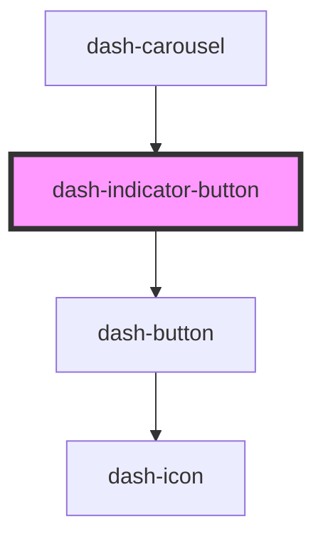

# dash-indicator-button

<!-- Auto Generated Below -->

## Properties

| Property | Attribute | Description                          | Type      | Default |
| -------- | --------- | ------------------------------------ | --------- | ------- |
| `active` | `active`  | Whether the item is currently active | `boolean` | `false` |

## Dependencies

### Used by

 - [dash-carousel](../dash-carousel)

### Depends on

- [dash-button](../dash-button)

### Graph

----------------------------------------------

*Built with [StencilJS](https://stenciljs.com/)*
