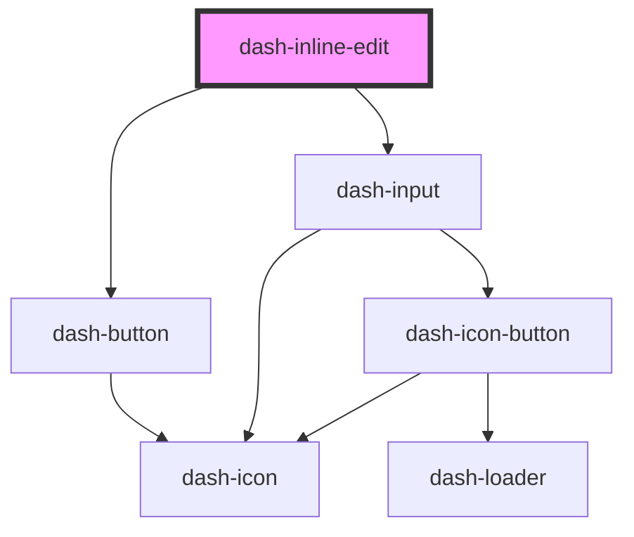

# dash-inline-edit

<!-- Auto Generated Below -->

## Properties

| Property | Attribute | Description | Type     | Default     |
| -------- | --------- | ----------- | -------- | ----------- |
| `value`  | `value`   |             | `string` | `undefined` |

## Events

| Event                        | Description | Type                  |
| ---------------------------- | ----------- | --------------------- |
| `dashInlineEditValueChanged` |             | `CustomEvent<string>` |

## Dependencies

### Depends on

- [dash-button](../dash-button)
- [dash-input](../dash-input)

### Graph

----------------------------------------------

*Built with [StencilJS](https://stenciljs.com/)*
