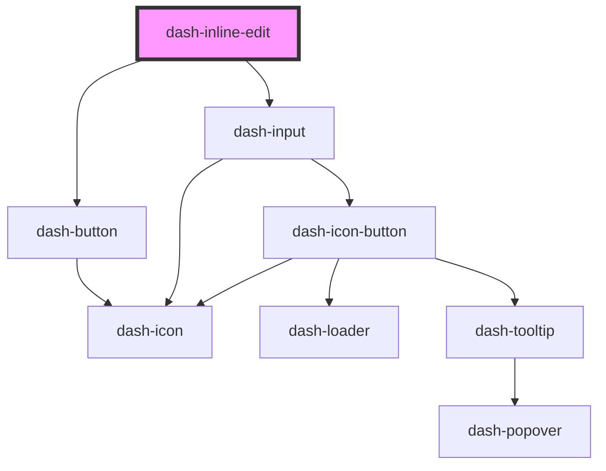

# dash-inline-edit

<!-- Auto Generated Below -->

## Properties

| Property   | Attribute  | Description                       | Type                | Default     |
| ---------- | ---------- | --------------------------------- | ------------------- | ----------- |
| `disabled` | `disabled` | When `true`, disabled interaction | `boolean`           | `undefined` |
| `scale`    | `scale`    | Size of the inline edit           | `"l" \| "m" \| "s"` | `'m'`       |
| `value`    | `value`    | Value to be used for editing      | `string`            | `undefined` |

## Events

| Event                        | Description                                           | Type                |
| ---------------------------- | ----------------------------------------------------- | ------------------- |
| `dashInlineEditValueChanged` | Emitted when the value has been changed and confirmed | `CustomEvent<void>` |

## Dependencies

### Depends on

- [dash-button](../dash-button)
- [dash-input](../dash-input)

### Graph

----------------------------------------------

*Built with [StencilJS](https://stenciljs.com/)*
