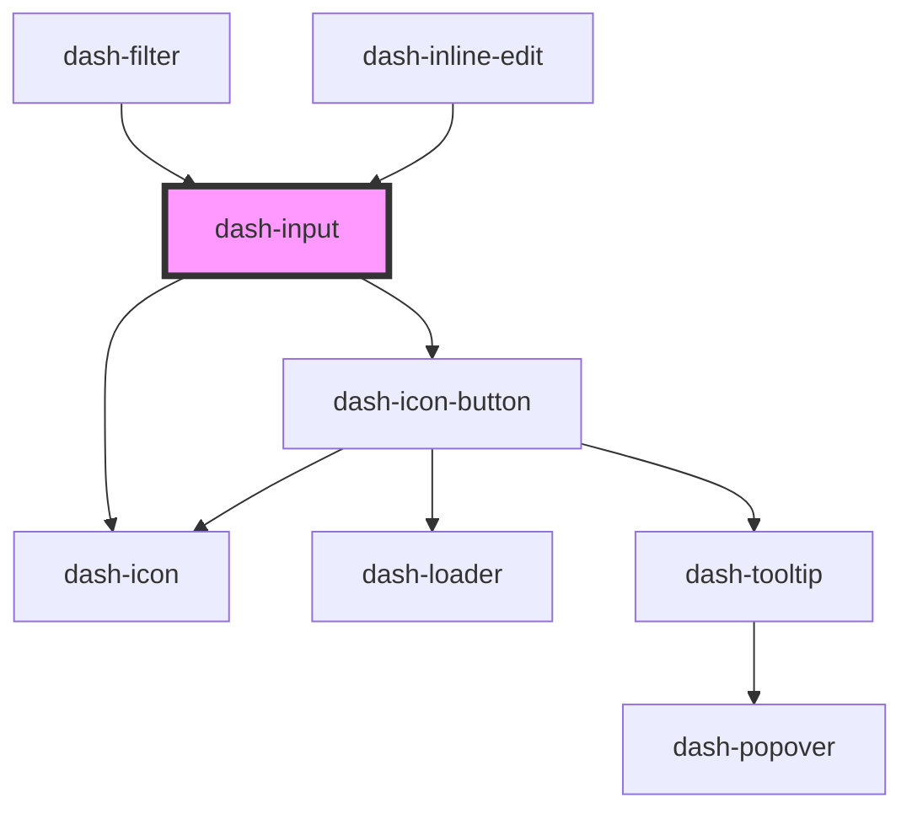

# dash-input

<!-- Auto Generated Below -->

## Properties

| Property      | Attribute     | Description                                                                                                                                                 | Type                | Default     |
| ------------- | ------------- | ----------------------------------------------------------------------------------------------------------------------------------------------------------- | ------------------- | ----------- |
| `clearable`   | `clearable`   | When `true`, a clear button will be displayed at the end of the input                                                                                       | `boolean`           | `undefined` |
| `debounce`    | `debounce`    | Debounces input changes in milliseconds Note: debounce is only initialized on component load. Modifying debounce after initialization will not do anything. | `number`            | `undefined` |
| `icon`        | `icon`        | Icon displayed at the end of the input                                                                                                                      | `string`            | `undefined` |
| `placeholder` | `placeholder` | Placeholder text for input                                                                                                                                  | `string`            | `undefined` |
| `scale`       | `scale`       | Size of the input                                                                                                                                           | `"l" \| "m" \| "s"` | `'m'`       |
| `type`        | `type`        | Input type                                                                                                                                                  | `string`            | `undefined` |
| `value`       | `value`       | Value of input                                                                                                                                              | `string`            | `undefined` |

## Events

| Event             | Description                          | Type                |
| ----------------- | ------------------------------------ | ------------------- |
| `dashInputInput`  | Emitted when input changes           | `CustomEvent<void>` |
| `dashInputSubmit` | Emitted only when input is submitted | `CustomEvent<void>` |

## Methods

### `select() => Promise<void>`

Selects text in input

#### Returns

Type: `Promise<void>`

### `setFocus() => Promise<void>`

Sets focus on this element

#### Returns

Type: `Promise<void>`

## Dependencies

### Used by

 - [dash-filter](../dash-filter)
 - [dash-inline-edit](../dash-inline-edit)

### Depends on

- [dash-icon](../dash-icon)
- [dash-icon-button](../dash-icon-button)

### Graph

----------------------------------------------

*Built with [StencilJS](https://stenciljs.com/)*
