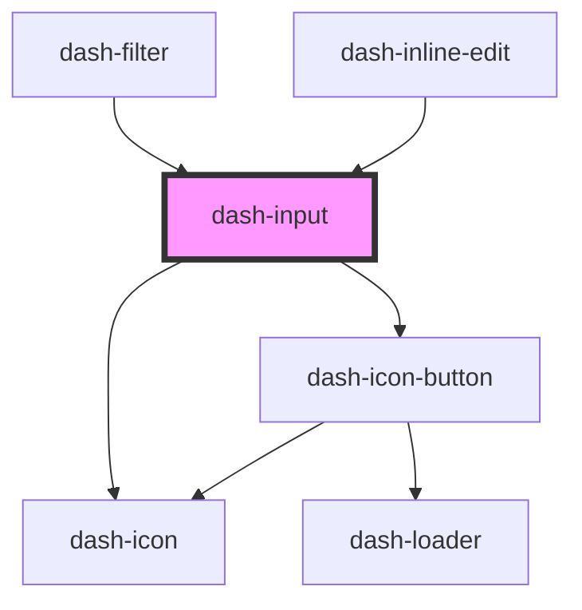

# dash-input

<!-- Auto Generated Below -->

## Properties

| Property      | Attribute     | Description | Type                        | Default     |
| ------------- | ------------- | ----------- | --------------------------- | ----------- |
| `clearable`   | `clearable`   |             | `boolean`                   | `undefined` |
| `debounce`    | `debounce`    |             | `number`                    | `undefined` |
| `icon`        | `icon`        |             | `string`                    | `undefined` |
| `placeholder` | `placeholder` |             | `string`                    | `undefined` |
| `scale`       | `scale`       |             | `"l" \| "m" \| "s" \| "xl"` | `'m'`       |
| `type`        | `type`        |             | `string`                    | `undefined` |
| `value`       | `value`       |             | `string`                    | `undefined` |

## Events

| Event             | Description | Type                  |
| ----------------- | ----------- | --------------------- |
| `dashInputInput`  |             | `CustomEvent<string>` |
| `dashInputSubmit` |             | `CustomEvent<any>`    |

## Methods

### `select() => Promise<void>`

#### Returns

Type: `Promise<void>`

### `setFocus() => Promise<void>`

#### Returns

Type: `Promise<void>`

## Dependencies

### Used by

 - [dash-filter](../dash-filter)
 - [dash-inline-edit](../dash-inline-edit)

### Depends on

- [dash-icon](../dash-icon)
- [dash-icon-button](../dash-icon-button)

### Graph

----------------------------------------------

*Built with [StencilJS](https://stenciljs.com/)*
