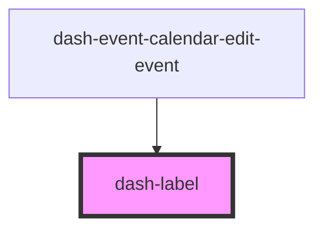

# dash-label

<!-- Auto Generated Below -->

## Properties

| Property | Attribute | Description | Type                                              | Default     |
| -------- | --------- | ----------- | ------------------------------------------------- | ----------- |
| `for`    | `for`     |             | `string`                                          | `undefined` |
| `layout` | `layout`  |             | `"default" \| "inline" \| "inline-space-between"` | `'default'` |

## Dependencies

### Used by

 - [dash-event-calendar-edit-event](../dash-event-calendar/dash-event-calendar-edit-event)

### Graph

----------------------------------------------

*Built with [StencilJS](https://stenciljs.com/)*
