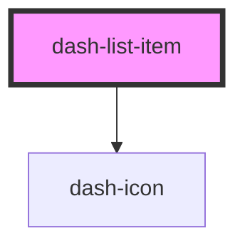

# dash-list-item

<!-- Auto Generated Below -->

## Properties

| Property        | Attribute        | Description | Type                               | Default     |
| --------------- | ---------------- | ----------- | ---------------------------------- | ----------- |
| `disabled`      | `disabled`       |             | `boolean`                          | `undefined` |
| `scale`         | `scale`          |             | `"l" \| "m" \| "s"`                | `'m'`       |
| `selected`      | `selected`       |             | `boolean`                          | `false`     |
| `selectionMode` | `selection-mode` |             | `"multiple" \| "none" \| "single"` | `'single'`  |

## Events

| Event                              | Description | Type                |
| ---------------------------------- | ----------- | ------------------- |
| `dashInternalListItemMoveNext`     |             | `CustomEvent<void>` |
| `dashInternalListItemMovePrevious` |             | `CustomEvent<void>` |
| `dashListItemSelectedChanged`      |             | `CustomEvent<void>` |

## Methods

### `setFocus() => Promise<void>`

#### Returns

Type: `Promise<void>`

## Dependencies

### Depends on

- [dash-icon](../dash-icon)

### Graph

----------------------------------------------

*Built with [StencilJS](https://stenciljs.com/)*
