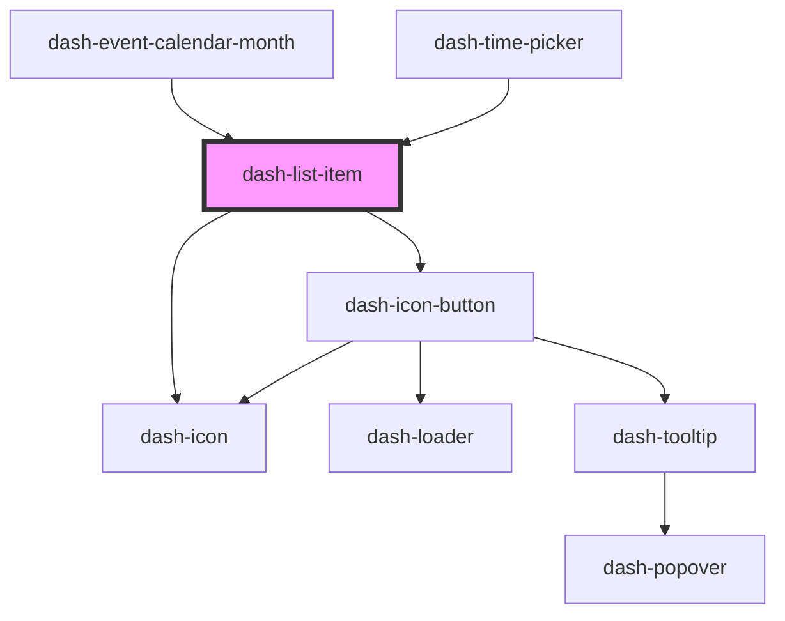

# dash-list-item

<!-- Auto Generated Below -->

## Properties

| Property          | Attribute          | Description                             | Type      | Default     |
| ----------------- | ------------------ | --------------------------------------- | --------- | ----------- |
| `disableDeselect` | `disable-deselect` | Whether the list item can be deselected | `boolean` | `undefined` |
| `disabled`        | `disabled`         | When `true`, interaction is disabled    | `boolean` | `undefined` |
| `dragEnabled`     | `drag-enabled`     | Whether the list item can be dragged    | `boolean` | `undefined` |
| `selected`        | `selected`         | When `true`, list-item is selected      | `boolean` | `false`     |
| `value`           | `value`            | Value of the list-item                  | `any`     | `undefined` |

## Events

| Event                         | Description                       | Type                |
| ----------------------------- | --------------------------------- | ------------------- |
| `dashListItemSelectedChanged` | Emitted when selected has changed | `CustomEvent<void>` |

## Methods

### `setFocus() => Promise<void>`

Sets focus on this element

#### Returns

Type: `Promise<void>`

## Dependencies

### Used by

 - [dash-event-calendar-month](../dash-event-calendar/dash-event-calendar-month)
 - [dash-time-picker](../dash-time-picker)

### Depends on

- [dash-icon](../dash-icon)
- [dash-icon-button](../dash-icon-button)

### Graph

----------------------------------------------

*Built with [StencilJS](https://stenciljs.com/)*
