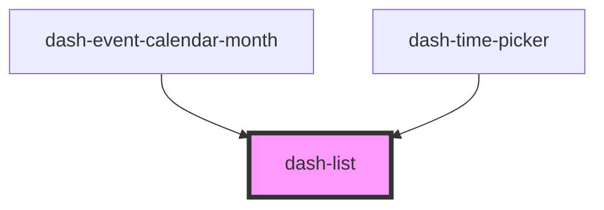

# dash-list

<!-- Auto Generated Below -->

## Properties

| Property        | Attribute        | Description | Type                               | Default    |
| --------------- | ---------------- | ----------- | ---------------------------------- | ---------- |
| `scale`         | `scale`          |             | `"l" \| "m" \| "s"`                | `'m'`      |
| `selectionMode` | `selection-mode` |             | `"multiple" \| "none" \| "single"` | `'single'` |

## Dependencies

### Used by

 - [dash-event-calendar-month](../dash-event-calendar/dash-event-calendar-month)
 - [dash-time-picker](../dash-time-picker)

### Graph

----------------------------------------------

*Built with [StencilJS](https://stenciljs.com/)*
