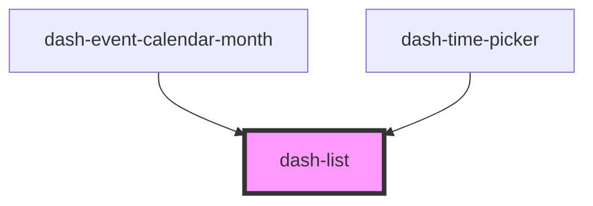

# dash-list

<!-- Auto Generated Below -->

## Properties

| Property          | Attribute          | Description                                                            | Type                                                 | Default     |
| ----------------- | ------------------ | ---------------------------------------------------------------------- | ---------------------------------------------------- | ----------- |
| `disableDeselect` | `disable-deselect` | Whether the list items can be deselected                               | `boolean`                                            | `undefined` |
| `dragEnabled`     | `drag-enabled`     | Whether the list item can be dragged                                   | `boolean`                                            | `undefined` |
| `maxItems`        | `max-items`        | Number of items to show in the list - a scrollbar appears for overflow | `number`                                             | `undefined` |
| `scale`           | `scale`            | Size of the list and its items                                         | `"l" \| "m" \| "s"`                                  | `'m'`       |
| `selectionMode`   | `selection-mode`   | Selection mode of the list and its items                               | `"multiple" \| "no-selection" \| "none" \| "single"` | `'single'`  |

## Events

| Event                    | Description                                       | Type                                     |
| ------------------------ | ------------------------------------------------- | ---------------------------------------- |
| `dashListItemsReordered` | Emitted when the list items are reordered         | `CustomEvent<HTMLDashListItemElement[]>` |
| `dashListReorderEnd`     | Emitted when the list items stop being reordered  | `CustomEvent<void>`                      |
| `dashListReorderStart`   | Emitted when the list items start to be reordered | `CustomEvent<void>`                      |

## Dependencies

### Used by

 - [dash-event-calendar-month](../dash-event-calendar/dash-event-calendar-month)
 - [dash-time-picker](../dash-time-picker)

### Graph

----------------------------------------------

*Built with [StencilJS](https://stenciljs.com/)*
