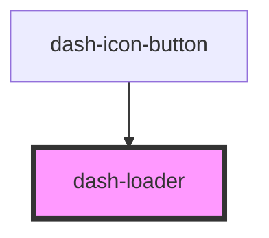

# dash-loader

<!-- Auto Generated Below -->

## Properties

| Property | Attribute | Description | Type                | Default     |
| -------- | --------- | ----------- | ------------------- | ----------- |
| `scale`  | `scale`   |             | `"l" \| "m" \| "s"` | `undefined` |

## Dependencies

### Used by

 - [dash-icon-button](../dash-icon-button)

### Graph

----------------------------------------------

*Built with [StencilJS](https://stenciljs.com/)*
