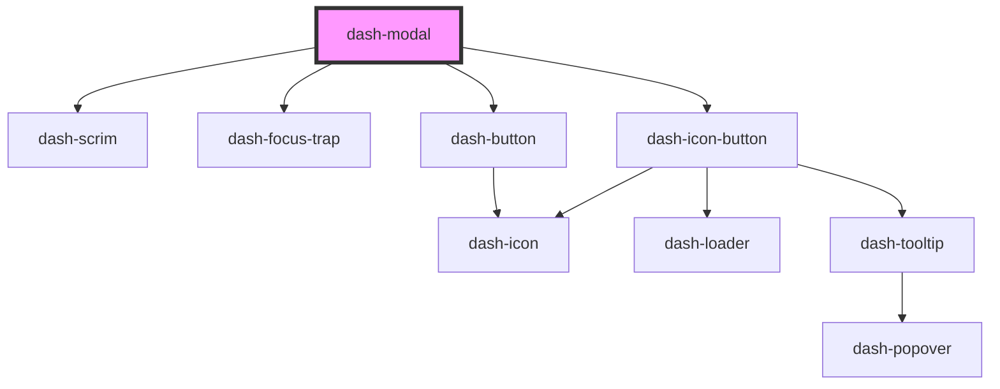

# dash-modal

<!-- Auto Generated Below -->

## Properties

| Property                      | Attribute                        | Description                                                                                           | Type                | Default     |
| ----------------------------- | -------------------------------- | ----------------------------------------------------------------------------------------------------- | ------------------- | ----------- |
| `autoFocus`                   | `auto-focus`                     | When `true`, sets focus on the close button if it's available                                         | `boolean`           | `undefined` |
| `disableFullscreenMobileView` | `disable-fullscreen-mobile-view` | When `true`, the modal will not automatically go into fullscreen mode when the screen size is mobile. | `boolean`           | `undefined` |
| `fullscreen`                  | `fullscreen`                     | When `true`, modal is in fullscreen mode                                                              | `boolean`           | `undefined` |
| `heading`                     | `heading`                        | Modal heading                                                                                         | `string`            | `undefined` |
| `hideCloseButton`             | `hide-close-button`              | When `true`, the close button is not displayed                                                        | `boolean`           | `undefined` |
| `open`                        | `open`                           | When `true`, the modal is open                                                                        | `boolean`           | `undefined` |
| `scale`                       | `scale`                          | Size of the modal                                                                                     | `"l" \| "m" \| "s"` | `'m'`       |

## Events

| Event                  | Description                                                                          | Type               |
| ---------------------- | ------------------------------------------------------------------------------------ | ------------------ |
| `dashModalBeforeClose` | Emitted when the modal is about to close (before the animation starts playing)       | `CustomEvent<any>` |
| `dashModalClosed`      | Emitted after the modal's close animation completes and the modal is actually closed | `CustomEvent<any>` |

## Methods

### `close() => Promise<void>`

Closes the modal

#### Returns

Type: `Promise<void>`

## Dependencies

### Depends on

- [dash-scrim](../dash-scrim)
- [dash-focus-trap](../dash-focus-trap)
- [dash-icon-button](../dash-icon-button)
- [dash-button](../dash-button)

### Graph

----------------------------------------------

*Built with [StencilJS](https://stenciljs.com/)*
