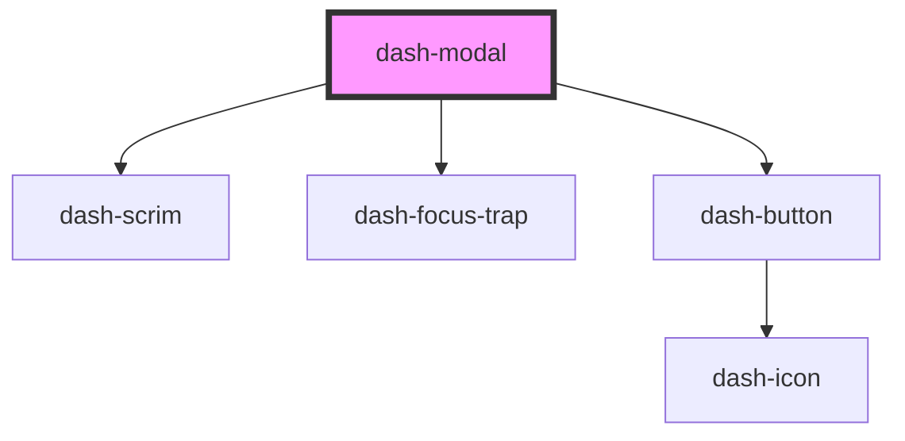

# dash-modal

<!-- Auto Generated Below -->

## Properties

| Property                      | Attribute                        | Description | Type                        | Default     |
| ----------------------------- | -------------------------------- | ----------- | --------------------------- | ----------- |
| `autoFocus`                   | `auto-focus`                     |             | `boolean`                   | `undefined` |
| `disableFullscreenMobileView` | `disable-fullscreen-mobile-view` |             | `boolean`                   | `undefined` |
| `fullscreen`                  | `fullscreen`                     |             | `boolean`                   | `undefined` |
| `heading`                     | `heading`                        |             | `string`                    | `undefined` |
| `hideCloseButton`             | `hide-close-button`              |             | `boolean`                   | `undefined` |
| `scale`                       | `scale`                          |             | `"l" \| "m" \| "s" \| "xl"` | `'m'`       |

## Events

| Event                  | Description | Type               |
| ---------------------- | ----------- | ------------------ |
| `dashModalBeforeClose` |             | `CustomEvent<any>` |
| `dashModalClosed`      |             | `CustomEvent<any>` |

## Methods

### `close() => Promise<void>`

#### Returns

Type: `Promise<void>`

## Dependencies

### Depends on

- [dash-scrim](../dash-scrim)
- [dash-focus-trap](../dash-focus-trap)
- [dash-button](../dash-button)

### Graph

----------------------------------------------

*Built with [StencilJS](https://stenciljs.com/)*
