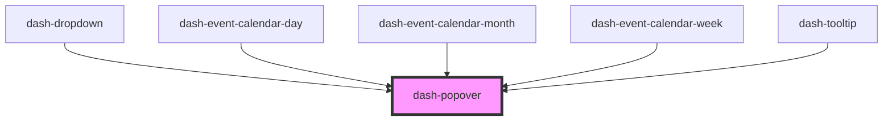

# dash-popover

<!-- Auto Generated Below -->

## Properties

| Property            | Attribute            | Description                                                            | Type                                                                                                                                                                                                         | Default      |
| ------------------- | -------------------- | ---------------------------------------------------------------------- | ------------------------------------------------------------------------------------------------------------------------------------------------------------------------------------------------------------ | ------------ |
| `active`            | `active`             | When true, the popover will be open                                    | `boolean`                                                                                                                                                                                                    | `undefined`  |
| `autoClose`         | `auto-close`         | When true, popover will autoclose when it loses focus                  | `boolean`                                                                                                                                                                                                    | `undefined`  |
| `offsetX`           | `offset-x`           | Offset the popover in the x direction in pixels                        | `number`                                                                                                                                                                                                     | `undefined`  |
| `offsetY`           | `offset-y`           | Offset the popover in the y direction in pixels                        | `number`                                                                                                                                                                                                     | `undefined`  |
| `placement`         | `placement`          | Position of the popover relative to its target                         | `"auto" \| "auto-end" \| "auto-start" \| "bottom" \| "bottom-end" \| "bottom-start" \| "left" \| "left-end" \| "left-start" \| "right" \| "right-end" \| "right-start" \| "top" \| "top-end" \| "top-start"` | `'bottom'`   |
| `placementStrategy` | `placement-strategy` | Strategy of placing the popover                                        | `"absolute" \| "fixed"`                                                                                                                                                                                      | `'absolute'` |
| `stayInView`        | `stay-in-view`       | Keeps the popover in view if it's positioned outside the window's view | `boolean`                                                                                                                                                                                                    | `undefined`  |
| `target`            | `target`             | Popover target reference, can either be an element or element id       | `HTMLElement \| string`                                                                                                                                                                                      | `undefined`  |

## Events

| Event              | Description                        | Type                             |
| ------------------ | ---------------------------------- | -------------------------------- |
| `dashPopoverClose` | Emitted when the popover is closed | `CustomEvent<PopoverCloseEvent>` |
| `dashPopoverOpen`  | Emitted when the popover is opened | `CustomEvent<any>`               |

## Dependencies

### Used by

 - [dash-dropdown](../dash-dropdown)
 - [dash-event-calendar-day](../dash-event-calendar/dash-event-calendar-day)
 - [dash-event-calendar-month](../dash-event-calendar/dash-event-calendar-month)
 - [dash-event-calendar-week](../dash-event-calendar/dash-event-calendar-week)
 - [dash-tooltip](../dash-tooltip)

### Graph

----------------------------------------------

*Built with [StencilJS](https://stenciljs.com/)*
