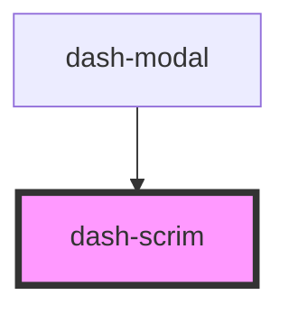

# dash-scrim

<!-- Auto Generated Below -->

## Properties

| Property | Attribute | Description                     | Type      | Default     |
| -------- | --------- | ------------------------------- | --------- | ----------- |
| `active` | `active`  | When true, the scrim is visible | `boolean` | `undefined` |

## Dependencies

### Used by

 - [dash-modal](../dash-modal)

### Graph

----------------------------------------------

*Built with [StencilJS](https://stenciljs.com/)*
