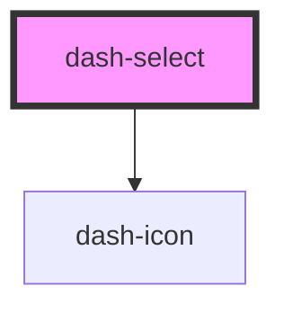

# dash-select

<!-- Auto Generated Below -->

## Properties

| Property   | Attribute  | Description                                                                                                                                                                                                                                                                                                             | Type                | Default     |
| ---------- | ---------- | ----------------------------------------------------------------------------------------------------------------------------------------------------------------------------------------------------------------------------------------------------------------------------------------------------------------------- | ------------------- | ----------- |
| `disabled` | `disabled` | This Boolean attribute indicates that the user cannot interact with the control.  https://developer.mozilla.org/en-US/docs/Web/HTML/Element/select                                                                                                                                                                      | `boolean`           | `undefined` |
| `form`     | `form`     | The <form> element to associate the <select> with (its form owner). The value of this attribute must be the id of a <form> in the same document. (If this attribute is not set, the <select> is associated with its ancestor <form> element, if any.)  https://developer.mozilla.org/en-US/docs/Web/HTML/Element/select | `string`            | `undefined` |
| `name`     | `name`     | This attribute is used to specify the name of the control.  https://developer.mozilla.org/en-US/docs/Web/HTML/Element/select                                                                                                                                                                                            | `string`            | `undefined` |
| `required` | `required` | A Boolean attribute indicating that an option with a non-empty string value must be selected. https://developer.mozilla.org/en-US/docs/Web/HTML/Element/select                                                                                                                                                          | `boolean`           | `undefined` |
| `scale`    | `scale`    | Scale of select                                                                                                                                                                                                                                                                                                         | `"l" \| "m" \| "s"` | `undefined` |

## Events

| Event                   | Description | Type                |
| ----------------------- | ----------- | ------------------- |
| `dashSelectValueChange` |             | `CustomEvent<void>` |

## Dependencies

### Depends on

- [dash-icon](../dash-icon)

### Graph

----------------------------------------------

*Built with [StencilJS](https://stenciljs.com/)*
