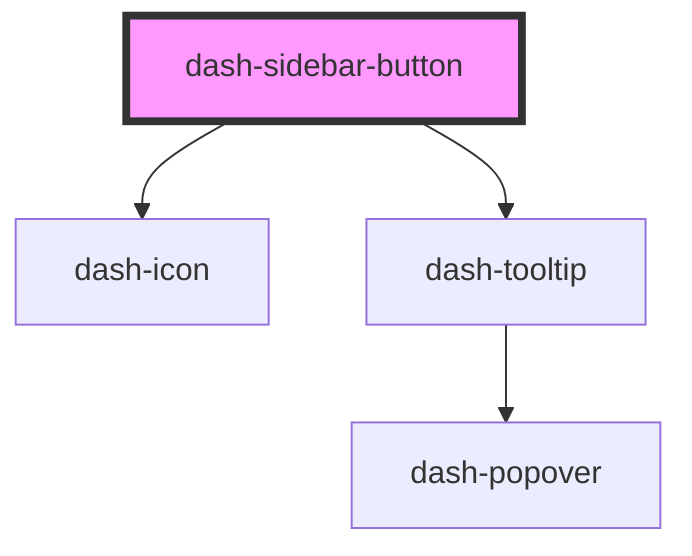

# dash-sidebar-button

<!-- Auto Generated Below -->

## Properties

| Property    | Attribute    | Description                                  | Type      | Default     |
| ----------- | ------------ | -------------------------------------------- | --------- | ----------- |
| `active`    | `active`     | When `true`, the button is visibly active    | `boolean` | `undefined` |
| `collapsed` | `collapsed`  | When `true`, the button is in collapsed mode | `boolean` | `undefined` |
| `icon`      | `icon`       | Icon displayed at the start of the button    | `string`  | `undefined` |
| `iconColor` | `icon-color` | Sets the color of the icon                   | `string`  | `undefined` |
| `text`      | `text`       | Button text to display                       | `string`  | `undefined` |

## Dependencies

### Depends on

- [dash-icon](../dash-icon)
- [dash-tooltip](../dash-tooltip)

### Graph

----------------------------------------------

*Built with [StencilJS](https://stenciljs.com/)*
