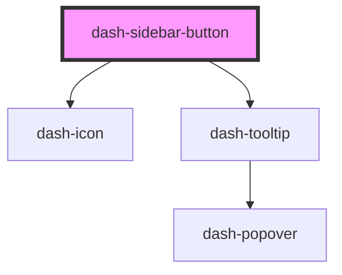

# dash-sidebar-button

<!-- Auto Generated Below -->

## Properties

| Property    | Attribute    | Description | Type      | Default     |
| ----------- | ------------ | ----------- | --------- | ----------- |
| `active`    | `active`     |             | `boolean` | `undefined` |
| `collapsed` | `collapsed`  |             | `boolean` | `undefined` |
| `icon`      | `icon`       |             | `string`  | `undefined` |
| `iconColor` | `icon-color` |             | `string`  | `undefined` |
| `text`      | `text`       |             | `string`  | `undefined` |

## Dependencies

### Depends on

- [dash-icon](../dash-icon)
- [dash-tooltip](../dash-tooltip)

### Graph

----------------------------------------------

*Built with [StencilJS](https://stenciljs.com/)*
