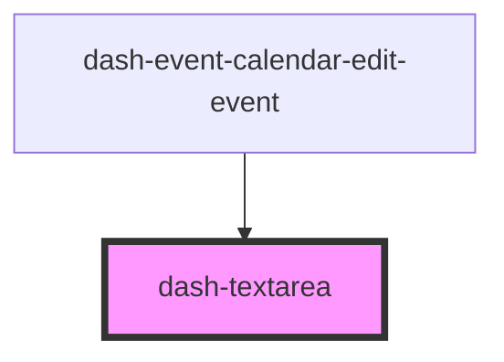

# dash-textarea

<!-- Auto Generated Below -->

## Properties

| Property      | Attribute     | Description | Type                                   | Default     |
| ------------- | ------------- | ----------- | -------------------------------------- | ----------- |
| `cols`        | `cols`        |             | `number`                               | `undefined` |
| `placeholder` | `placeholder` |             | `string`                               | `undefined` |
| `readonly`    | `readonly`    |             | `boolean`                              | `undefined` |
| `required`    | `required`    |             | `boolean`                              | `undefined` |
| `resize`      | `resize`      |             | `"both" \| "horizontal" \| "vertical"` | `'both'`    |
| `rows`        | `rows`        |             | `number`                               | `undefined` |
| `value`       | `value`       |             | `string`                               | `undefined` |

## Events

| Event               | Description | Type               |
| ------------------- | ----------- | ------------------ |
| `dashTextareaInput` |             | `CustomEvent<any>` |

## Dependencies

### Used by

 - [dash-event-calendar-edit-event](../dash-event-calendar/dash-event-calendar-edit-event)

### Graph

----------------------------------------------

*Built with [StencilJS](https://stenciljs.com/)*
