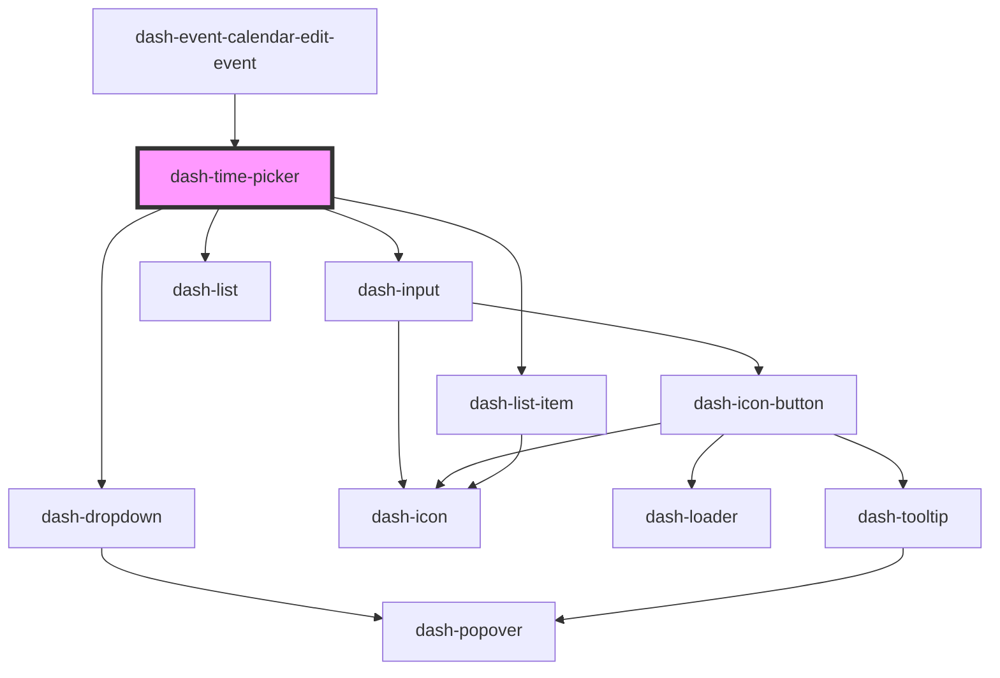

# dash-time-picker

<!-- Auto Generated Below -->

## Properties

| Property | Attribute | Description | Type     | Default                                |
| -------- | --------- | ----------- | -------- | -------------------------------------- |
| `time`   | `time`    |             | `string` | `startOfDay(new Date()).toISOString()` |

## Events

| Event                      | Description | Type                |
| -------------------------- | ----------- | ------------------- |
| `dashTimePickerTimeChange` |             | `CustomEvent<void>` |

## Dependencies

### Used by

 - [dash-event-calendar-edit-event](../dash-event-calendar/dash-event-calendar-edit-event)

### Depends on

- [dash-dropdown](../dash-dropdown)
- [dash-input](../dash-input)
- [dash-list](../dash-list)
- [dash-list-item](../dash-list-item)

### Graph

----------------------------------------------

*Built with [StencilJS](https://stenciljs.com/)*
