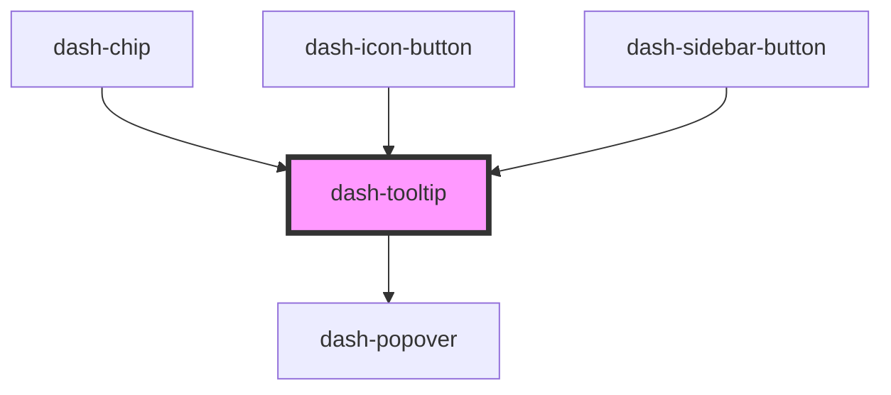

# dash-tooltip

<!-- Auto Generated Below -->

## Properties

| Property            | Attribute            | Description                                                           | Type                                                                                                                                                                                                         | Default      |
| ------------------- | -------------------- | --------------------------------------------------------------------- | ------------------------------------------------------------------------------------------------------------------------------------------------------------------------------------------------------------ | ------------ |
| `arrow`             | `arrow`              | When true, an arrow is displayed on the tooltip                       | `boolean`                                                                                                                                                                                                    | `undefined`  |
| `enabled`           | `enabled`            | When true, tooltip is visible                                         | `boolean`                                                                                                                                                                                                    | `undefined`  |
| `offsetX`           | `offset-x`           | Offset the tooltip in the x direction in pixels                       | `number`                                                                                                                                                                                                     | `undefined`  |
| `offsetY`           | `offset-y`           | Offset the tooltip in the y direction in pixels                       | `number`                                                                                                                                                                                                     | `undefined`  |
| `placement`         | `placement`          | Position of the tooltip relative to its target                        | `"auto" \| "auto-end" \| "auto-start" \| "bottom" \| "bottom-end" \| "bottom-start" \| "left" \| "left-end" \| "left-start" \| "right" \| "right-end" \| "right-start" \| "top" \| "top-end" \| "top-start"` | `'bottom'`   |
| `placementStrategy` | `placement-strategy` | Strategy the tooltip is placed                                        | `"absolute" \| "fixed"`                                                                                                                                                                                      | `'absolute'` |
| `scale`             | `scale`              | Size of the tooltip                                                   | `"l" \| "m" \| "s"`                                                                                                                                                                                          | `'m'`        |
| `target`            | `target`             | Target reference element where the tooltip will be positioned next to | `HTMLElement \| string`                                                                                                                                                                                      | `undefined`  |
| `text`              | `text`               | Text value to be displayed in tooltip                                 | `string`                                                                                                                                                                                                     | `undefined`  |

## Dependencies

### Used by

 - [dash-chip](../dash-chip)
 - [dash-icon-button](../dash-icon-button)
 - [dash-sidebar-button](../dash-sidebar-button)

### Depends on

- [dash-popover](../dash-popover)

### Graph

----------------------------------------------

*Built with [StencilJS](https://stenciljs.com/)*
