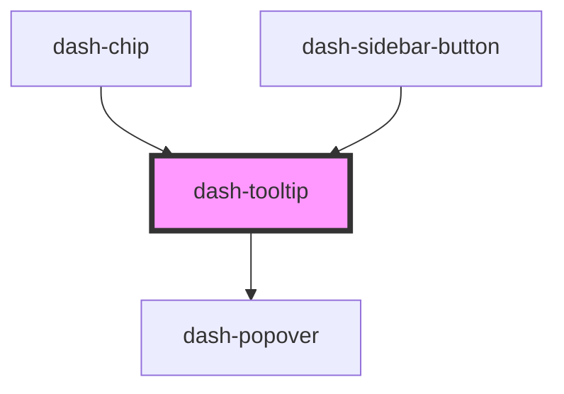

# dash-tooltip

<!-- Auto Generated Below -->

## Properties

| Property            | Attribute            | Description | Type                                                                                                                                                                                                         | Default      |
| ------------------- | -------------------- | ----------- | ------------------------------------------------------------------------------------------------------------------------------------------------------------------------------------------------------------ | ------------ |
| `arrow`             | `arrow`              |             | `boolean`                                                                                                                                                                                                    | `undefined`  |
| `enabled`           | `enabled`            |             | `boolean`                                                                                                                                                                                                    | `undefined`  |
| `offsetX`           | `offset-x`           |             | `number`                                                                                                                                                                                                     | `undefined`  |
| `offsetY`           | `offset-y`           |             | `number`                                                                                                                                                                                                     | `undefined`  |
| `placement`         | `placement`          |             | `"auto" \| "auto-end" \| "auto-start" \| "bottom" \| "bottom-end" \| "bottom-start" \| "left" \| "left-end" \| "left-start" \| "right" \| "right-end" \| "right-start" \| "top" \| "top-end" \| "top-start"` | `'bottom'`   |
| `placementStrategy` | `placement-strategy` |             | `"absolute" \| "fixed"`                                                                                                                                                                                      | `'absolute'` |
| `scale`             | `scale`              |             | `"l" \| "m" \| "s" \| "xl"`                                                                                                                                                                                  | `'m'`        |
| `target`            | `target`             |             | `HTMLElement \| string`                                                                                                                                                                                      | `undefined`  |
| `text`              | `text`               |             | `string`                                                                                                                                                                                                     | `undefined`  |

## Dependencies

### Used by

 - [dash-chip](../dash-chip)
 - [dash-sidebar-button](../dash-sidebar-button)

### Depends on

- [dash-popover](../dash-popover)

### Graph

----------------------------------------------

*Built with [StencilJS](https://stenciljs.com/)*
