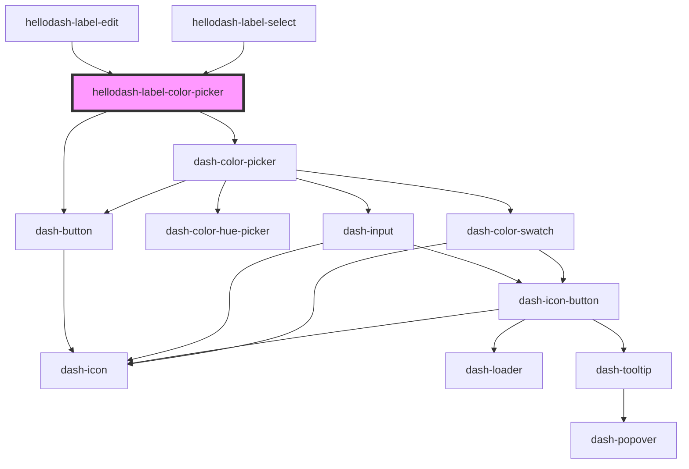

# hellodash-label-color-picker

<!-- Auto Generated Below -->

## Properties

| Property    | Attribute | Description        | Type      | Default     |
| ----------- | --------- | ------------------ | --------- | ----------- |
| `allLabels` | --        |                    | `Label[]` | `[]`        |
| `color`     | `color`   | Color as hex value | `string`  | `undefined` |

## Events

| Event                                   | Description | Type                  |
| --------------------------------------- | ----------- | --------------------- |
| `hellodashLabelColorPickerColorChanged` |             | `CustomEvent<string>` |

## Dependencies

### Used by

 - [hellodash-label-edit](../hellodash-label-edit)
 - [hellodash-label-select](../hellodash-label-select)

### Depends on

- dash-color-picker
- dash-button

### Graph

----------------------------------------------

*Built with [StencilJS](https://stenciljs.com/)*
